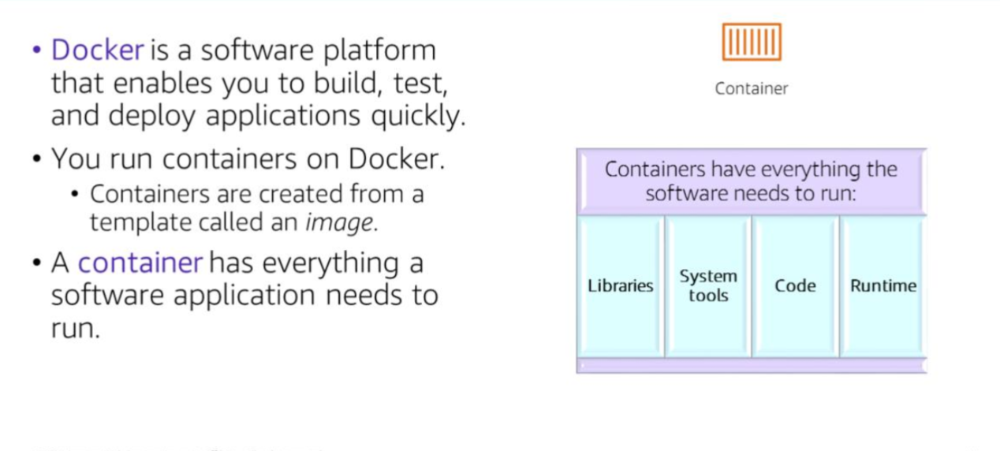
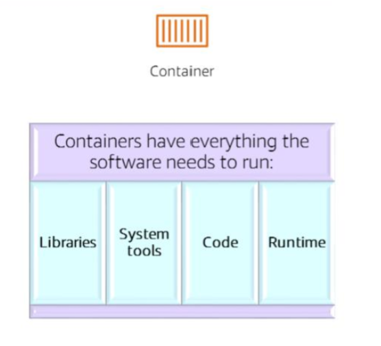
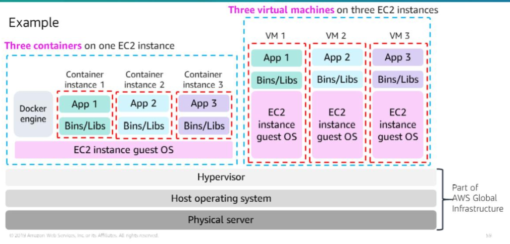
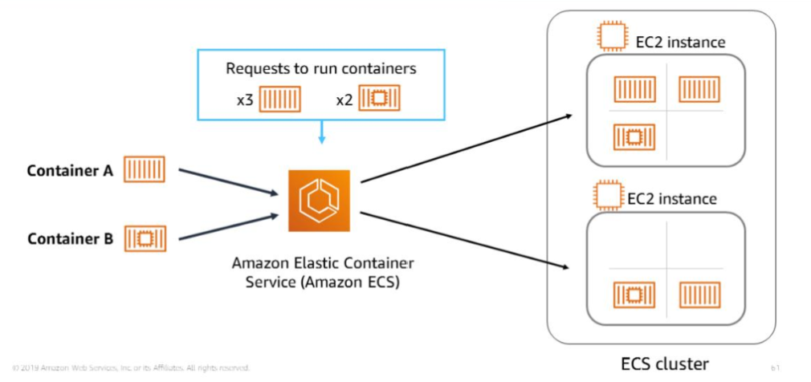
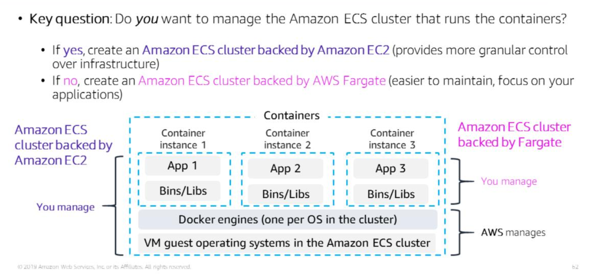

# Section 4: Container services

Method of operating system virtualisation (which is the process of running an application and its dependencies in resource-isolated processes).

Containers hold everything a software needs to run (libraries, code, runtime environment, system tools). This means they don't have any external dependencies, giving them environmental consistency. 

Containers share a virtualised operating system.

Container images are much smaller than virtual machine images, making them faster to start. 

### Docker

A software platform that allows you to run software packaged in containers

A Docket is installed on each server that will host containers and provides simple commands to manage your containers.

Some Docket use cases:
- Standardised environments
- Reduce conflicts between language stacks and versions
- Containers as a service
- Running microservices using stndardised code deployments
- Portability for data processing

Containers are created from a template called an image (this is analogous to how a virtual machine is created from a machine image).

### Containers vs Virtual Machines

Multiple containers can run alongside each other on one and the same OS.

Each virtual machine requires its own OS.

The Docker engine manages how containers are run and their lifecycle.

### ECS (Elastic Container Service)
- Orchestrates the running of Docker containers 
- Manages EC2 instances that run your containers
- Removes complexity of standing up the infrastructure

Create a task definition (text file describing one to ten containers) that forms your application.

Task definitions specify your application parameters like which containers, ports and data volumes should be used with the task.

A task is an instance of a task definition within a cluster.

The Amazon ECS task scheduler is responsible for placing tasks within your ECS cluster.

An ECS cluster contains a group/fleet of EC2 instances. Each EC2 instance runs an Amazon ECS container agent.

ECS places the 5 containers on the EC2 instances in the ECS cluster. The distribution accounts for CPU and RAM of each cluster node (EC2 instance)

### ECS cluster options

- Amazon ECS cluster backed by Amazon EC2 gives you more fine-grained control over your infrastructure
  - you manage the underlying EC2 instances as would you if you launched an EC2 instance
- Amazon ECS cluster backed by AWS Fargate is easier to maintain, allowing you to focus on your applications
  - AWS manages your clusters (optimisation, scaling, packing)
  - you just need to define networking and IAM policies

### Kubernetes

Open source container orchestration software

Deploy and manage containerised applications at scale

Complements Docker
- Docker lets you run multiple containers on a single OS host
- Kubernetes orchestrates multiple Docker hosts

Kubernetes manages a cluster of compute instances (nodes) and containers are run on these compute instances in logical groupings called pods.

Pods can include multiple containers and can be scaled.
Pods have an IP address and a DNS name which Kubernetes uses to connect your services with external traffic.

Kubernetes automates container provisioning, networking, load distribution and scaling.

### Amazon EKS (Elastic Kubernetes Service)

Simplifies the running of Kubernetes on AWS

- Manage EC2 compute instance clusters
- Run containers orchestrated by Kubernetes on those instances

### Amazon ECR (Elastic Container Registry)

Docker container registry to store, manage and deploy Docker container images.

- Integrates with ECS
- Supports Docker Registry HTTP API version 2
  - use Docker CLI commands to interact with ECR
- You can use HTTPS to make container image transfer to and from ECS.
- Container images at rest are encrypted with S3 server-side encryption
- You can also use ECR with EKS
