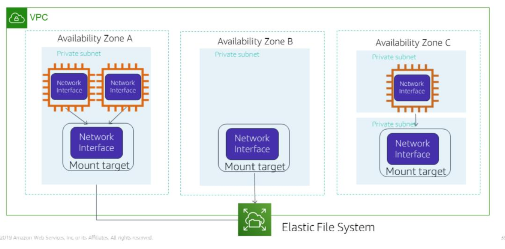

# Section 3: Amazon EFS (Elastic File System)

A simple file storage system based in the AWS Cloud that automatically scales from GB to 1000s of TBs

### EFS architecture

Each file system has these properties:
- ID
- Creation token
- Creation time
- File system size in bytes
- Number of mount targets
- File system state
- Tags (optional) which serve as metadata

Each mount target must belong to a VPC and has these properties:
- ID
- subnet ID in which it resides
- file system ID
- IP address for where the file system can be mounted
- mount target state

### EFS creation

Assuming that you have running EC2 instances:

1. Create a file system using EFS
2. Create a mount target in the appropriate subnet.
3. Connect your EC2 instances to the mount target.
4. Your EC2 instances can then read and write to the file system

EC2 instances in different availability zones can access the same file system so along as they are in the same Region as the file system.

The file system can be concurrently accessed by thousands of EC2 instances via standard file I/O APIs.

