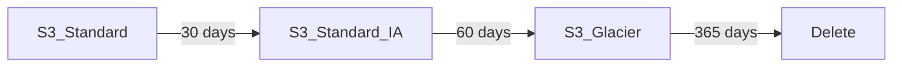
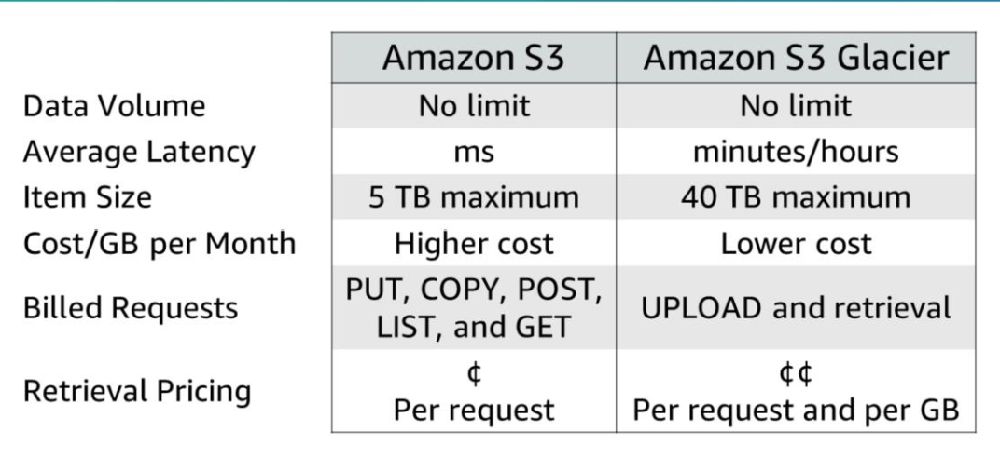

# Section 4: S3 Glacier

A data archiving service designed to be secure, durable and low cost.

S3 buckets optimised for storing data with high latency but large storage sizes.

This makes it good for storing archives which tend to be in large volume but infrequently accessed.

### Key terms
Archives
Archives are objects (photos, video files, documents ...)
Archives are the smallest unit of storage.
Each archive has a unique id

Vault
A vault is a container for archives
Valuts have a name and belong to only one AWS Region.

Vault access policy
An access policy at the level of vaults which determines who can access the vault and the sort of operations that they can do

A vault lock policy can be added to ensure that the vault cannot be altered.
Each vault can have at most one access and one lock policy.

Vaults are replicated across at least 3 availability zones.

Three types of data retrival options
| Type      | Retrieval time |
|-----------|----------------|
| Expedited | 1-5 minutes    |
| Standard  | 3-5 hours      |
| Bulk      | 5-12 hours     |

Example use cases
- Media asset archiving
- Healthcare information archiving
- Regulatory and compliance archiving
- Scientific data archiving
- Digital preservation
- Magnetic tape replacement

S3 Glavier Vault Lock helps you to set compliance controls to meet compliance requirements
S3 Glacier performs regular, systematic data integrity checks and is designed to be self-healing.

### Accessing S3 Glacier

- AWS Console
  - has limited operations
- RESTful web services
- Java / .NET SDKs
- AWS CLI
- S3 lifecycle policies

### S3 lifecycle policies

S3 lifecyle policies enable you to automate the movement of data between S3 storage solutions as the data ages, gradually moving the data from more expensive and easily accessible S3 storage classes to less expensive and less easily accessible storage classes.

Lifecycle rules can be applied at the level of individual objects or individual buckets.

### S3 or S3 Glacier?

### Server-Side Encryption

Server-size encryption focuses on protecting data at rest.

Data archived in S3 Glacier is encrypted by default.
With S3, your application must enable server-side encryption.

Three ways of setting up server-side encryption in AWS S3:

1. Amazon S3-managed encryption keys (SSE-S3)
   - encrypts each object with a unique key.
   - encrypts each object key with a main that is regularly rotated
   - encryption is done with AES-256
2. Customer-provided Encryption Keys (SSE-C)
   - you choose your own encryption keys and AWS S3 manages the encryption and decryption.
3. AWS Key Management Service (AWS KMS)
   - Customer Master Keys (CMKs) are used to encryption your S3 objects
   - either go to IAM console -> Encryption Keys -> AWS KMS or use the AWS KMS API

