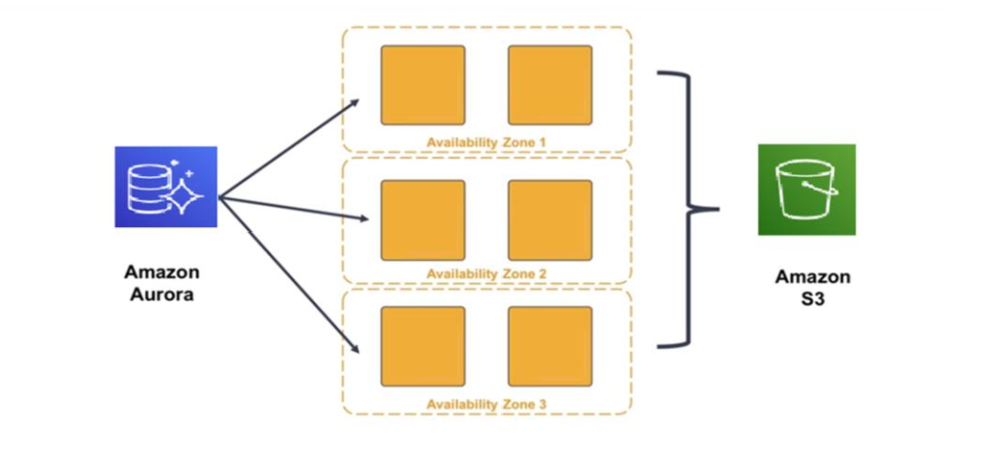

# Section 3: Amazon Aurora

A fully-managed MySQL and PostgreSQL compatible relational database service in the cloud.

Combines the performance and availability of high-end commercial databases with the simplicity and cost-effectiveness of open-source databases.

Designed to automate provisioning, patching, backup, recovery, failure detection and repair tasks.

### Key features

Drop-in compability with MySQL and PostgreSQL engines lets you use familiar database tools and interfaces 
High availability and a fast distributed storage subsystem.
Integrates with AWS Schema Conversion Tool and Database Migration Service to make cloud migration as smooth as possible
Pay as you go pricing model

### High availability

Designed for high avilability and resilience

- Multiple copies of your data is stored in multiple availability zones
- Data is continuous backed up to S3
- Create up to 15 read-only replicas
- Designed for instant crash recovery if your primary database becomes unhealthy

### Resilient design

Because the redo log from the last database checkpoint is replayed on every read operation, the restart time of a database crash is usually very fast (within 60 seconds).

The buffer cache is moved out of the database process, so it's available immediately at restart

