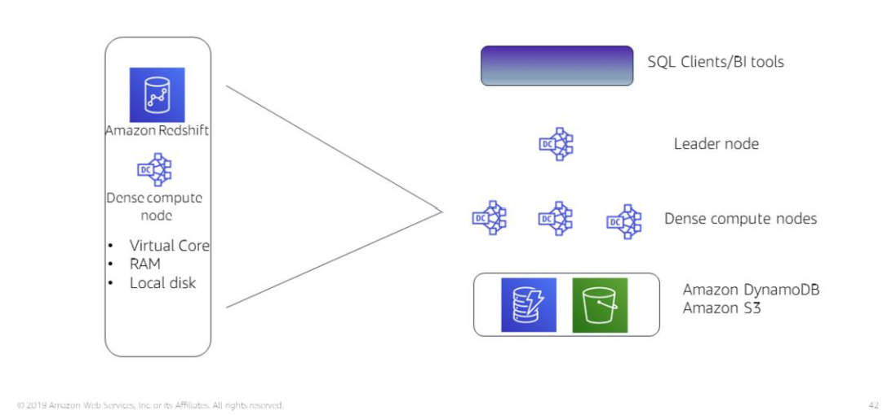

# Section 3: Amazon Redshift

Managed data warehouse service that lets you run complex analytical SQL queries against huge data sets (petabytes)

Redshift makes use of 
- parallel data processing
- columnar storage on local disks
- sophisticated query optimisation

### Parallel processing architecture

The leader node manages communication between the SQL clients and the dense compute nodes

The leader node receives the query from the SQL client, arranges it into explicit manageable steps and then compiles the code and assigns the task of running the code to individual dense compute nodes.

The dense compute nodes run the code and return the results back to the leader node.

The leader node then aggregates the results before sending them back to SQL client.

Amazon Redshift Spectrum lets you run queries against exabytes of data (1000s of petabytes of data) directly in AWS S3.

### Monitoring and scaling

Built-in data encryption for data at rest and data in transit
Redshift clusters also have automatic scaling that you can manually provision.

### Accessing Redshift

- SQL
- JDBC (Java Database Connectivity)
- ODBC (Open Database Connectivity)

### Example use cases

- Big data environments
  - low price point for small customers
  - Managed service lets you focus on data processing and analysis rather than database management and maintenance
- Enterprise Data Warehouses
  - No upfront costs for experimentation
  - Gradual migration to the cloud
- SaaS
  - add analytic functionality to your applications

