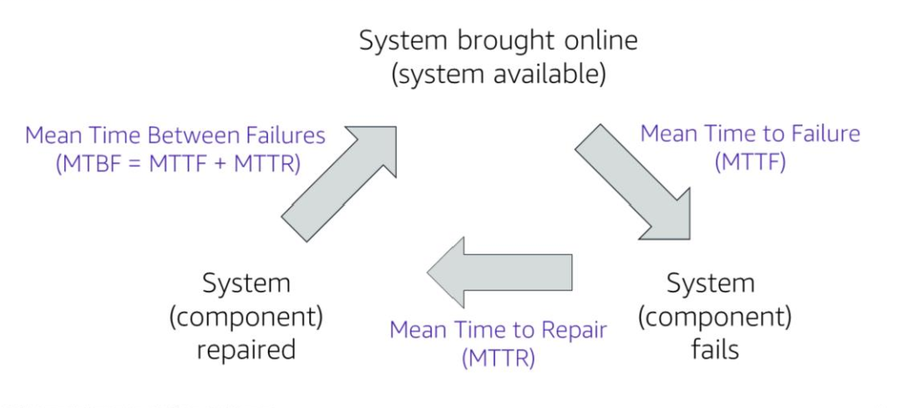
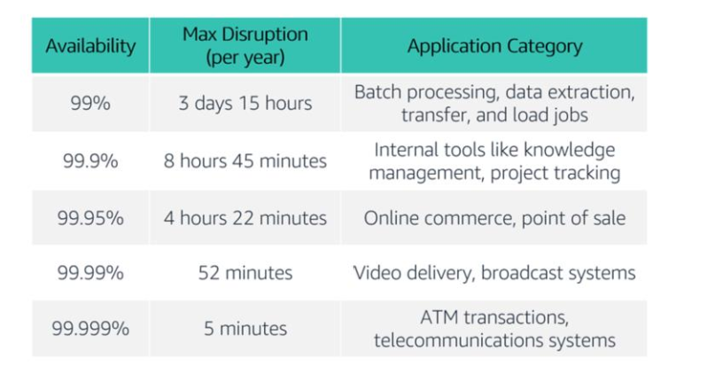

# Section 2: Reliability and High Availability

### AWS Well-Architected Tool

- reviews your workloads and compares them to AWS best practices
- provides a process for you to review and measure your cloud architectures
  
When architecting application workloads to withstand failure, we should consider two important factors:
- reliability
- availability

### Reliability

Reliability is the ability of your system to provide functionality when desired by the user.

Formally, it's the probability that your system will function as intended for a specified period of time where system includes components such as hardware, firmware and software.

The mean time between failures (MTBF) is one way of quantifying the reliability of a system:

$$ 
\frac
{\text{total time in service}}
{\text{number of failures}} 
$$

##### Reliability metrics

Time to failure (length of time the application is available)

Time to repair (length of time it takes to repair the application)

Mean time between failures (MTBF) is the sum of the mean time to failure and mean time to repair

$$ 
\text{Mean Time Between Failures} = \text{Mean Time to Failure} + \text{Mean Time to Repair} $$

### Availability

Availability is the percentage of the time that an application is functioning as intended

$$ \text{Availability} = \frac{\text{normal operation time}}{\text{total time}}
$$

Another way to frame this is in terms of percentage of uptime over a period of time. For example, 90% uptime over a year.

Number of 9s is often used a shorthand to denote availability. Five 9s would denote 99.999% availability and three 9s would denote 99.9% availability.

### Highly availability

A highly available system is resilient and can withstand some measure of degration whilst staying available.

Highly available systems minimise downtime and human intervention.

Software is combined with hardware to minimise downtime by restoring services when a system or application fails.

Availability tiers for common types of applications

### Three factors that influence availability

- Fault tolerance
  - built-in redudancy of a system
  - ability of an application to remain operational even if some of its components fail
  - specialised hardware is used to detect system faults and to instantaneously switch to redundant hardware components
  - affects availability at the hardware level
- Scalability
  - ability of an application to accommodate changes in capacity needs without changing its design
  - scalability tends to increase availability
- Recoverability
  - ability of an application or service to overcome failures and catastrophic events 

Highly available applications and systems tend to be more costly. It is a good idea to aim to strike a balance between cost and availability.