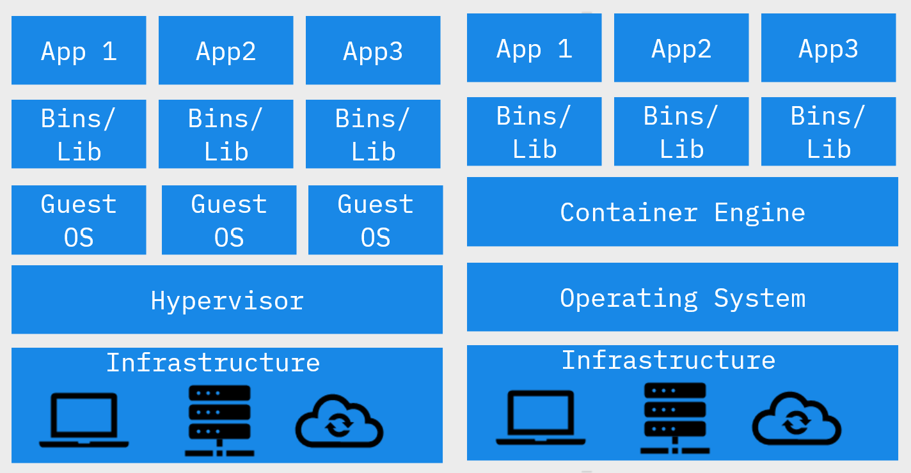

# Introduction to Containers

A container is a way to build and run executable software.

A container is an executable unit of software in which application code is packaged, along with its libraries and dependencies, in common ways so that it can be run anywhere, whether on a desktop, on-premises, or in the cloud.

Containers make use of operating system virtualisation which involves isolating processes and controlling the amount of CPU, memory and disk storage that processes have access to.

### Advantages of containers

- Lightweight
- Portable
- Architecture
- Utilization

**Lightweight**

Because containers don't include an OS, their smaller size makes them faster to spin up compared to virtual machines. They are also better suited for horizontal scaling since we don't have to duplicate the OS whenever we duplicate the app and its dependencies in a container.

**Portable**

Because containers carry their dependencies with them, they can be run in different environments without configuration. You don't have to worry about external influences from the environment.

**Architecture**

Because containers are portable and consistent across different platforms, they are well-suited for agile workflows.

Fast start-up times and consistency across different environments enables agile teams to deploy new features quickly and iteratively with containers

**Utilisation**

Because of how containers enable a microservice architecture, they provide finer-grained control over scaling than virtual machines. If an application is spread over many containers, developers can target exactly which parts of the application to scale instead of scaling the entire application.

Furthermore, because containers share an operating system, the resources can be shared intelligently such as redistributing resources from terminated containers to runnning containers.

### Containers vs Virtual Machines

Containers have a `container engine` that virtualises the underlying host operating system instead of a `hypervisor` that virtualises the underlying hardware.

We can run multiple `containers` on a single operating system without requiring each container to have its own guest OS, reducing the amount of resources consumed.

Containers running on a `container engine` can also be started much quicker than virtual machines. 

Because containers don't include an operating system, factors like differences in the development and production environment operating systems won't affect containerised applications. They will behave consistently across development and production environments.

### Container states

1. Waiting
2. Running
3. Terminated

### Use cases for containers

1. Microservices
2. DevOps
3. Hybrid cloud/on-premises architecture
4. App modernisation and migration to the cloud

Explain how the four advantages of containers make them suited for the above use cases.

