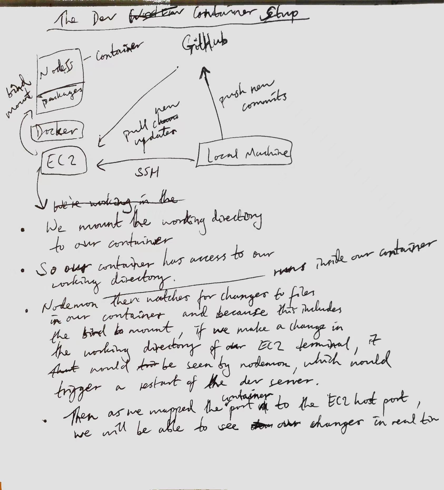

# Docker basics

### Work with running containers

Check running containers

```bash
docker ps       # Show running processes
docker ps -a    # Show all processes
```

Run a container in the background with port mappings.
The container will need the port to be exposed.

```bash
sudo docker run -d -p 3000:3000 getting-started
```

The `-d` flag runs the container in the background.
The `-p 3000:3000` creates a port mapping between the host's port and the container's port, host-port:container-port. This sends inbound traffic for host port 3000 to your container port 3000, effectively connecting your container to the host.

### Update source files and rebuild image

Update source files and rebuild a new version of your image.
Then stop the running container and run a container from the new image.

Stop and remove a container

Get the ID of the container

```bash
docker ps
```

Stop the container with `<container-id>`

```bash
docker stop <container-id>
```

Remove container with `<container-id>`

```bash
docker rm <container-id>
```

Stop and remove in one command

```bash
docker rm -f <container->
```

### Persist data through container restarts

Containers are isolated from each other.

To share a file directory between many containers, we need to mount a shared directory to those containers.

There are two types of volumes supported by the default Docker engine:

1. Named volumes
2. Bind mounts

[Volume type comparison table](https://docs.docker.com/get-started/06_bind_mounts/#quick-volume-type-comparisons)

#### Named volumes

Create a `named volume`

```bash
docker volume create <volume-name>
```

To view all volumes

```bash
docker volume ls
```

Mount the volume

```bash
docker run -dp 3000:3000 -v <volume-name>:/path/to/volume/ <image-name>
```

This mounts the volume with `<volume-name>` to `/path/to/volume`. Any files saved under `/path/to/volume/` will be persisted to the volume with `<volume-name>`.

To see your volume metadata

```bash
docker volume inspect <volume-name>
```

The `Mountpoint` field denotes the actual disk location where data is stored.

### Dev-mode containers

Run a container to support development workflow.

- Mount our source code into the container
- Install all dependencies, including the “dev” dependencies
- Start nodemon to watch for filesystem changes

With bind mounts, we can specify the host location of the volume to mount as shown by `$(pwd):/app` below.

```bash
docker run -dp 3000:3000 \
     -w /app -v "$(pwd):/app" \
     node:12-alpine \
     sh -c "yarn install && yarn run dev"
```

[Explanation of the above command](https://docs.docker.com/get-started/06_bind_mounts/#start-a-dev-mode-container)

The key move involves mounting our source code into the container.



### Multi container apps

Run a nodejs app and a MySQL database in separate containers on the same network so that they can communicate.

Pull a MySQL container image and run it on the `todo-app` network as a background process after mounting the volume `todo-mysql-data` and setting up environment variables for the root user password and the initial database name.

```bash
docker run -d \
     --network todo-app --network-alias mysql \
     -v todo-mysql-data:/var/lib/mysql \
     -e MYSQL_ROOT_PASSWORD=secret \
     -e MYSQL_DATABASE=todos \
     mysql:5.7
```

In the running container with id `mysql-container-id>`, execute the `mysql` command as the root user and prompt for password. Enter 'secret' as the password since this was set in the previous step.

```bash
docker exec -it <mysql-container-id> mysql -u root -p
```

#### Network debugging

Run the `nicolaka/netshoot` image which is container containing tools for debugging network issues.

```bash
docker run -it --network todo-app nicolaka/netshoot
```

Then run `dig <network-alias>` to obtain the IP address of a running container on the same network as the container created from `nicalaka/netshoot` by using its network alias. In short, it should show what IP address the network alias `mysql` corresponds to.

In this case, when we ran the container created from the `mysql:5.7` image, we gave it the network alias `mysql` with the `--network-alis mysql` flag. What this does is give an alias that we can use to refer to the IP address of the `mysql` container.

```bash
dig mysql
```

### Connect our App container to our MySQL container

Our app container can use the network alias `mysql` to connect to the MySQL database running in the `mysql` container. Here we specify use the network alias as the host in `MYSQL_HOST=mysql`.

```bash
 docker run -dp 3000:3000 \
   -w /app -v "$(pwd):/app" \
   --network todo-app \
   -e MYSQL_HOST=mysql \
   -e MYSQL_USER=root \
   -e MYSQL_PASSWORD=secret \
   -e MYSQL_DB=todos \
   node:12-alpine \
   sh -c "yarn install && yarn run dev"
```

Check messages logged to the console in the app container with

```bash
docker logs <app-container-id>
```

Add some todo items using the front-end webpage.

### Check data has persisted

Open a mysql shell connected to the todos database in MySQL.

```bash
docker exec -it <mysql-container-id> mysql -p todos
```

### Docker Compose

Alternative syntax for

```bash
docker run -dp 3000:3000 \
  -w /app -v "$(pwd):/app" \
  --network todo-app \
  -e MYSQL_HOST=mysql \
  -e MYSQL_USER=root \
  -e MYSQL_PASSWORD=secret \
  -e MYSQL_DB=todos \
  node:12-alpine \
  sh -c "yarn install && yarn run dev"
```

The `app` is the name of the service/container and also serves as its network alias.

Instead of `$(pwd):/app` for our bind mounted volume, we can use `./:/app` which uses relative relative paths instead of having to use the `pwd` command.

```yaml
version: "3.7"
services:
  app:
    image: node:12-alpine
    command: sh -c "yarn install && yarn run dev"
    ports:
      - 3000:3000
    working_dir: /app
    volumes:
      - ./:/app
    environment:
      MYSQL_HOST: mysql
      MYSQL_USER: root
      MYSQL_PASSWORD: secret
      MYSQL_DB: todos
```

Alternative syntax for the MySQL database container

```bash
docker run -d \
  --network todo-app --network-alias mysql \
  -v todo-mysql-data:/var/lib/mysql \
  -e MYSQL_ROOT_PASSWORD=secret \
  -e MYSQL_DATABASE=todos \
  mysql:5.7
```

The key point to note is that the volumes need to be declared at the top-level and then their mount point is specified under the `volumes` field of the `mysql` service.

```yaml
version: "3.7"

services:
  app:
    # The app service definition
  mysql:
    image: mysql:5.7
    volumes:
      - todo-mysql-data:/var/lib/mysql
    environment:
      MYSQL_ROOT_PASSWORD: secret
      MYSQL_DATABASE: todos

volumes:
  todo-mysql-data:
```

Putting the two together gives:

```yaml
version: "3.7"

services:
  app:
    image: node:12-alpine
    command: sh -c "yarn install && yarn run dev"
    ports:
      - 3000:3000
    working_dir: /app
    volumes:
      - ./:/app
    environment:
      MYSQL_HOST: mysql
      MYSQL_USER: root
      MYSQL_PASSWORD: secret
      MYSQL_DB: todos

  mysql:
    image: mysql:5.7
    volumes:
      - todo-mysql-data:/var/lib/mysql
    environment:
      MYSQL_ROOT_PASSWORD: secret
      MYSQL_DATABASE: todos

volumes:
  todo-mysql-data:
```

Start the application stack using `docker-compose up`. This will create the network, storage volumes and the two containers.

```bash
docker-compose up -d
```

Check the logs from all services

```bash
docker-compose logs
```

Check the logs from a specific service

```bash
docker-compose logs -f <service-name>
```

Stop all containers and remove the network.
n.b. to remove named volumes, run `docker-compose down --volumes`

```bash
docker-compose down
```

### Security scanning

Uses Snyk to scan your images for vulnerabilities.
Must be logged in to Docker Hub to work.

```bash
docker scan <image-name>
```

### Image layers

See how an image was built up layer by layer

```bash
docker history <image-name>
```

### Layer caching

Because layers are stacked, changing one layer means all layers above it need to be rebuilt.

By ordering steps in our Dockerfile efficiently, we can make the most of caching and reduce container image build times.

With the current Dockerfile, any changes in the `/app` directory will require all modules to be re-installed when the new image is rebuilt.

```bash
# syntax=docker/dockerfile:1
FROM node:12-alpine
WORKDIR /app
COPY . .
RUN yarn install --production
CMD ["node", "src/index.js"]
```

If we split the copy stage into two separate stages by first copying the `package.json` and installing packages before copying the rest of our source files, we won't need to re-install packages when building subsequent images in response to changes, so along as the `package.json` is unchanged. Any source file changes we make will affect the `COPY . .` step and since it comes after the package installation, we can make the most out of the cached underlying layers when rebuilding the image, which will now include the layer of installed packages.

```bash
 # syntax=docker/dockerfile:1
 FROM node:12-alpine
 WORKDIR /app
 COPY package.json yarn.lock ./
 RUN yarn install --production
 COPY . .
 CMD ["node", "src/index.js"]
```

### Multi-stage builds

- Separates runtime and compile-time dependencies
- Ship only what your app needs

[Multi-stage builds](https://docs.docker.com/get-started/09_image_best/#multi-stage-builds)
