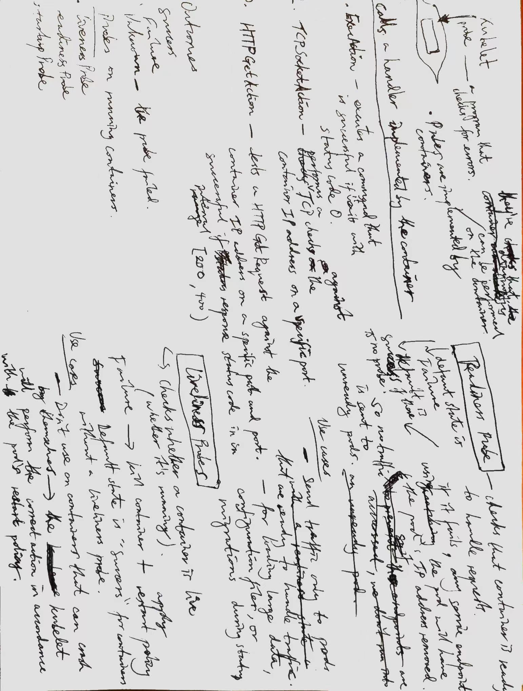

Probes are diagnostics that can be performed on containers. They are implemented by containers themselves. In this way, containers specify what diagnostic processes can be run on them to check for different statuses.

Probes are performed by Kubelets which calls a handler on a container.

Some handlers implemented by containers

1. ExecAction - executes a command that exits with status code 0 on success
2. TCPSocketAction - tests a TCP port of a container by performing a TCP check on a port for a container IP address
3. HTTPGetAction - tests HTTP Get requests to a container by running test GET requests to `container-host:container-port`. This is successful if `200 <= response status code < 400`.
Three kind of probes

Handler outcomes

- Success
- Failure
- Unknown (indicates that the probe failed)

#### Some probes on running containers

1. Liveliness Probe
    - checks that the container is running
2. Readiness Probe
    - checks that the container is ready to handle requests
3. Startup Probe
    - checks that the app in the container is running

