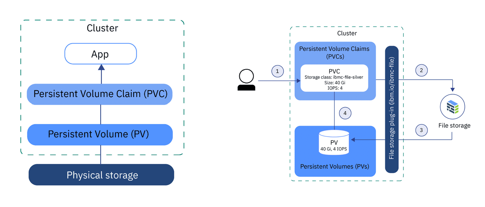

# Kubernetes volumes

Storage is managed separately to compute resources in Kubernetes clusters.

There are two API resources to help users manage storage.

- PersistentVolume (PV)
- PersistentVolumeClaim (PVC)

### PersistentVolume (PV)

A PersistentVolume is a piece of storage in the cluster. It's a resource just a like a Node.
They are volume plugins (like Volumes) but with a lifecycle independent from the Pods that use them.

The PersistentVolume API object provides an abstraction over the implementation details of the underlying storage system.

### PersistentVolumeClaim (PVC)

It's a request for storage by a user.

Just like how Pods consume Node resources, PersistentVolumeClaims consume PersistentVolume resources.

Pods request compute resources (CPU and memory) from Nodes.
PersistentVolumeClaims request storage sizes and access modes from PersistentVolumes.

The StorageClassResource offer a greater variety of storage properties than PersistentVolumes.