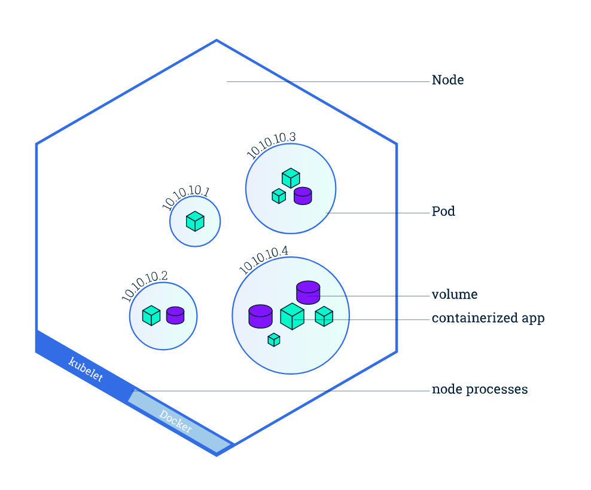

# Kubernetes

### Architecture


**Cluster** - a deployment of Kubernetes
**Daemon** - a program that runs continuously for the purpose of handling periodic requests

The control plane makes decisions and responds to events in the cluster.

High-level descriptions of various architecture components.

**etcd** - A key, value store of all cluster data (incl. app deployment configs) that serves a single source of truth for a cluster. https://etcd.io/

**kubenetes api server** - exposes the Kubernetes API through which all communications in the cluster use.

**kubenetes scheduler** - distributes your workloads by allocating pods to nodes.

**kubenetes controller manager** - a daemon that monitors the cluster state to ensure the actual state = desired by running controller processes.

**cloud controller manager** - let's Kubernetes interface with cloud providers through controllers.

**Nodes** - virtual/physical machines created by your cloud provider on which your pods run



**Pods** - the smallest unit of a deployment in Kubernetes. It's a process running in your cluster representing a single instance of an application and usually wraps a single container.

Shared resources include:
- Shared storage, as Volumes
- Networking, as a unique cluster IP address
- Information about how to run each container, such as the container image version or specific ports to use

**Kubelet** - 
  1. Uses the container runtime to start pods
  2. Monitors pods running on nodes and reports their health and status back to the control plane.
  3. Receives new and modified pod specifications and ensures that pods are running as desired

**Kube-proxy** - serves as a container runtime interface which let's you plug in a container runtime like Docker to pull images from container registries and to run them in containers.


**Controllers** - monitor the state of a Kubernetes cluster and takes action to ensure that the cluster's state matches your desired state. This done through a control loop that watches the cluster state through the `kube-api-server` and makes changes to actual state by sending instructings to the `kubelet` via the `kube-api-server`.

Controllers also track a Kubernetes object.

**Kubernetes objects**

- persistent entities that define the state of your cluster

They have two properties:

1. Object spec - the user-provided desired state of the object
2. Status - the actual state of the object which updates in real time provided by Kubernetes

Use the kubectl CLI to interact with objects or use the Kubernetes API directly by using one of the many client libraries provided by Kubernetes.

Examples of Kubernetes objects
- namespaces
- names
- labels
- selectors

A single cluster can be divided into several logically or conceptually distinct parts called `namespaces`. Within a `namespace`, objects with the same type must have distinct names. 

Many objects within the same `namespace` can be grouped by adding the same `label` to them.


#### The Kuberneetes Master

The Kubernetes Master is a collection of three processes that run on a single node in your cluster. These include: 

  - Kubernetes API server
  - Kubernetes controller manager
  - Kubernetes scheduler.


### Basic Kubernetes Objects

**Pods**

Represent a single instance of an application

We usually use a YAML file to define the objects we want to create declaractively when using the kubectl CLI

```yaml
apiVersion: v1
kind: Pod
metaData:
  name: nginx
spec:
  containers:
  - name: nginx
    image: nginx:1.7.9
    ports:
    - containerPort: 80
```

The first line must be `apiVersion: vx`, which indicates what version of the Kubernetes API you are using to create this object.

`kind: Pod` specifies the type of object you are creating. This will determine what goes in the `spec`.


With a pod object, there needs to be at least one container.

`name:` specifies the name of the container

`image:` specifies the container image

`ports:` lists ports on which to expose the container.


States of Pods

1. Pending - API server created pod and pod is stored in `etcd`
2. Running - pod is scheduled to a node and containers in pod have been created by the kubelet
3. Succeeded - all containers terminated successfully
4. Failed - all container terminated with at least one failed termination
5. Unknown - API server cannot query pod state.


Pods are the unit of replication and are replicated when scaling out your applications.
Containers within the same pod share resources like network bandwidth.

To scale your workloads efficiently, keep pods as minimal as possible. This is because if you need to scale a small part within a large pod, then you have no choice but to run a copy of the entire pod. And if the pod contains other containers that don't need to be scaled out, then you would be unnecessarily consuming extra resources.

An ideal pod would contain the main container plus a side-car, which is a helper-container.


**ReplicaSets**

ReplicaSets are objects that help you horizontally scale your pods. They let you run a group of identical pods. This is a bit like the AWS concept of EC2 scaling groups, but for pods.

Again, we can use YAML to define ReplicaSets declaratively. 

Things to note are the following fields:

-  `kind` specifies that this object will be a ReplicaSet
-  `replicas` - specifies how many copies of pods you want in the ReplicaSet
-  `template` - specifies the template of the pod that will be replicated
-  `selector` - specifies a reference to the template of pods that will run in the ReplicaSet. This allows the ReplicaSet to glean information about the state of its constituent pods.

```yaml
apiVersion: v1
kind: ReplicaSet
metadata: 
  name: nginx-replica
  labels:
    app: nginx
spec: 
  replicas: 3
  selector: 
    matchLabels:
      app: nginx
  template:
    metadata: 
      labels: 
        app: nginx
    spec: 
      containers: 
      - name: nginx
        image: nginx:1.7.9
        ports: 
        - containerPort: 80
```

It's not recommended to create ReplicaSets directly. Instead we should use Deployment objects to manage ReplicaSets.


**Deployment**

A Deployment object provides updates for Pods and ReplicaSets.

Deployment objects run multiple copies of an application by creating ReplicaSets and offer additional capabilities for managing them.

Deployment objects are only suitable for stateless applications. Use Stateful sets to deploy stateful applications.

The YAML specification of a Deployment object can look the same as a ReplicaSet.

```yaml
apiVersion: apps/v1
kind: Deployment
metadata: 
  name: nginx-deployment
  labels:
    app: nginx
spec: 
  replicas: 3
  selector: 
    matchLabels:
      app: nginx
  template:
    metadata: 
      labels: 
        app: nginx
    spec: 
      containers: 
      - name: nginx
        image: nginx:1.7.9
        ports: 
        - containerPort: 80
```

Deployments allow for rolling updates.

You can roll out a new version of your template and the Deployment object will scale the replica count of pods using the new template to the desired count and the pods using the old template to 0.

In this regard, Deployments are strict supersets of ReplicaSets. In addition to the Pod tracking feature that ReplicaSets provide, Deployments provide additional features like updating the template of Pods that make use of the features provided by ReplicaSets.


