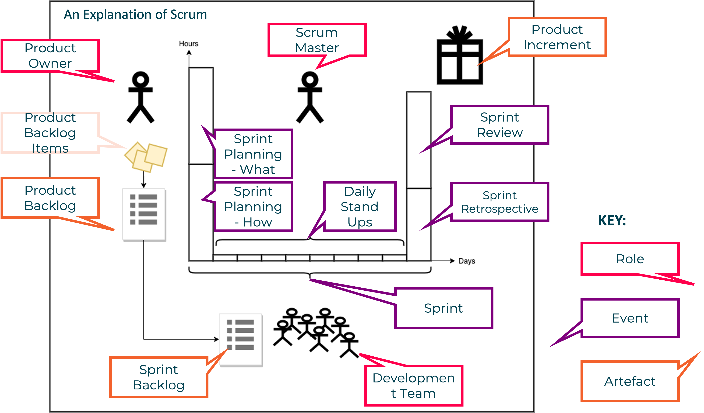

# What's SCRUM?

A project management methodology that promotes cross-functional, self-organised and empowered teams that divide their work into short, concentrated work cycles called sprints.

Benefits of SCRUM

Adaptable
Customer-centric 
Continuous delivery of value
Early delivery of high value
Continuous feedback
Transparency
Continuous improvement 
Sustainable pace
Efficient development process
Motivation
Faster problem resolution
Efective deliverables
Collective ownership
High velocity
Innovative environment

6 principles

Empirical process control
Time-boxing
Self-organisation
Collaboration
Value-based prioritisation
Iterative development

5 aspects

Organisation
Business justification
Quality 
Change
Risk

