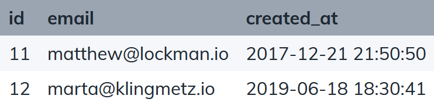
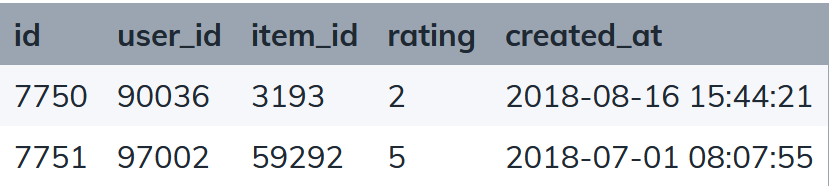
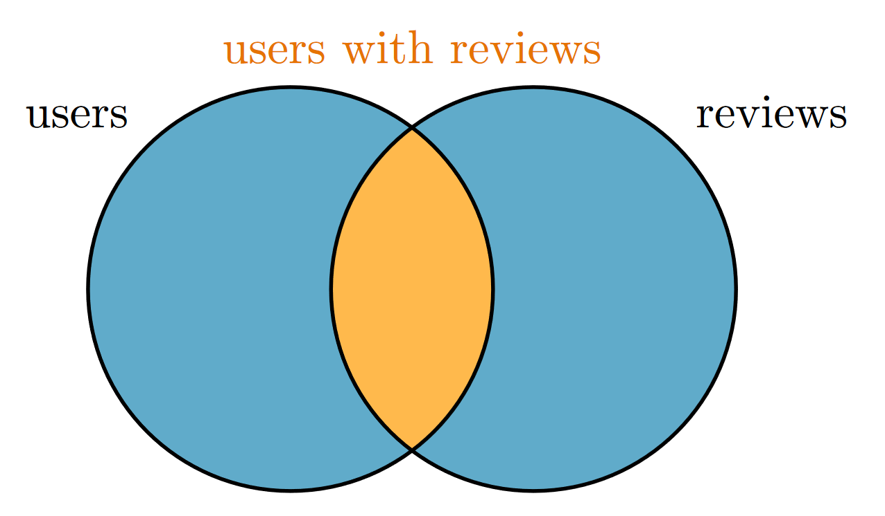

### 10. Percentage of users who leave reviews 

Question: Calculate the percentage of users who wrote at least 1 review.

In other words, we need to find the number of users who wrote at least 1 review and divide by the total number of users.

$$ \frac
{\text{number of users with reviews}}
{\text{number of users}}
$$


We need data from more than one table since reviews are stored in a different table to users. So we need to make use of a join.

This amounts to finding the the number of records in the users table whose primary key is the foreign key of some record in the reviews table and dividing by the number of records in the users table.

<figure>
    
    <figcaption>users table</figcaption>
</figure>
<figure>
    
    <figcaption>reviews table</figcaption>
</figure>

</br >

The LEFT JOIN is most appropriate for this purpose.



```sql {.line-numbers highlight=[4, 6-7, 11]}
WITH reviews_stats AS (
  SELECT 
    COUNT(DISTINCT(u.id)) AS total_users,
    COUNT(DISTINCT(r.user_id)) AS users_with_reviews
  FROM users u
  LEFT JOIN reviews r
    ON u.id = r.user_id
)

SELECT 
  ROUND(100.0 * users_with_reviews / total_users, 2) AS users_with_reviews_percentage
FROM reviews_stats
```

Lines 6-7

Users that have not written a review will not have a corresponding record in the `reviews` table, and so after performing the LEFT JOIN, all fields from the `reviews` table will be NULLs. 

Line 4

And since COUNT ignores NULLs, `COUNT(r.user_id)` will count only the users that have written at least 1 review.

We also use DISTINCT to count unique users with reviews because a user can write multiple reviews. Without this we would have counted the number of reviews rather than number of users with reviews.

Line 11

Finally we perform the division and round the result to 2 decimal places. Using a subquery is optional, but the advantages are greater readability and the potential for reusability if we need to create an SQL view later on.
