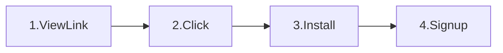
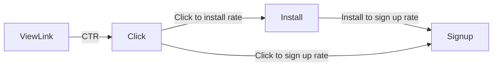

click -> install -> signp
view link -> click -> install -> signup

search how to draw diagrams using latex

**Mobile analytics marketing funnel**

Between Steps 2 and 3 the user is redirected to the adjust link which then takes the user to the App/Play store.

