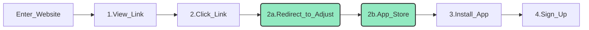
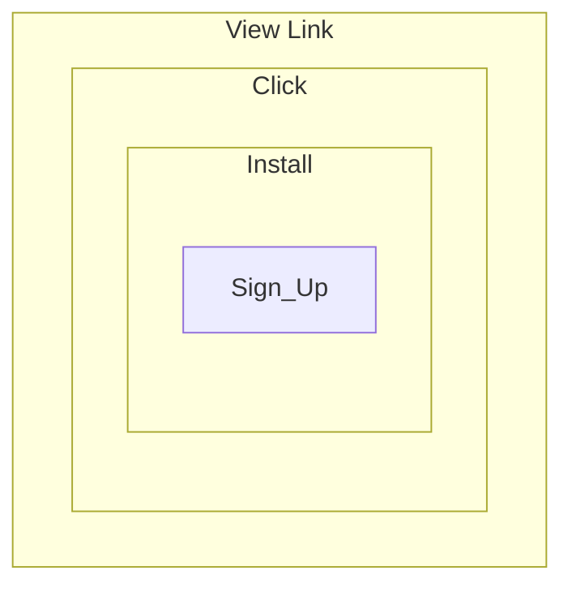
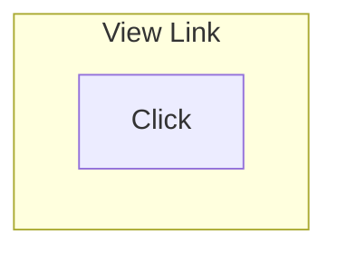

# Marketing Funnels

**Mobile analytics marketing funnel**

**Steps**
1. View link
2. Click clink
3. Install app
4. Sign up

**Visual diagram of funnel steps**


Between Steps 2 and 3 the user is redirected to the adjust link which then takes the user to the App/Play store.


**Marketing funnels in terms of venn diagrams**


		


Click Through Rate (CTR)
```latex {cmd: true}
\documentclass[border=0.2cm]{standalone}
 
% Required package
\usepackage{tikz}

\begin{document}
 
\begin{tikzpicture}
 
% Circle with label at 225 deg.
\node[draw,
    circle,
    minimum size =2cm,
    fill=cyan!50,
    label={225:$A$}] (circle1) at (0,0){};
 
% Circle with label at 45 deg.
\node[draw,
    circle,
    minimum size =2cm,
    fill=yellow!50,
    label={45:$B$}] (circle2) at (3,0){};
 
\end{tikzpicture}
 
\end{document}
```




