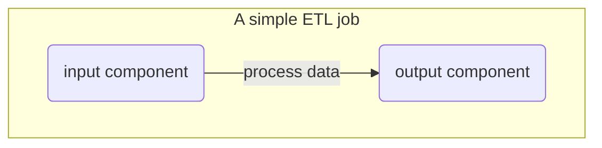
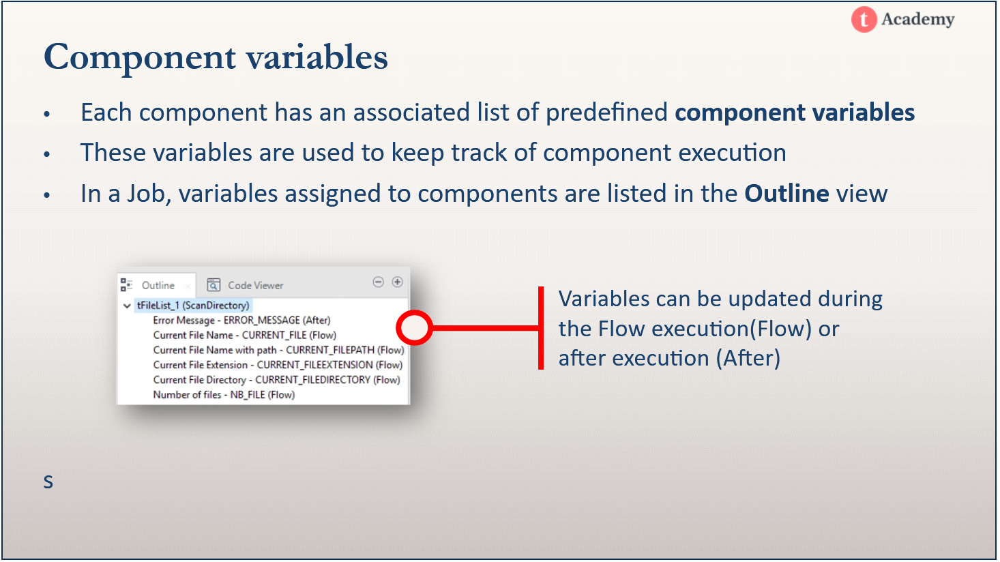
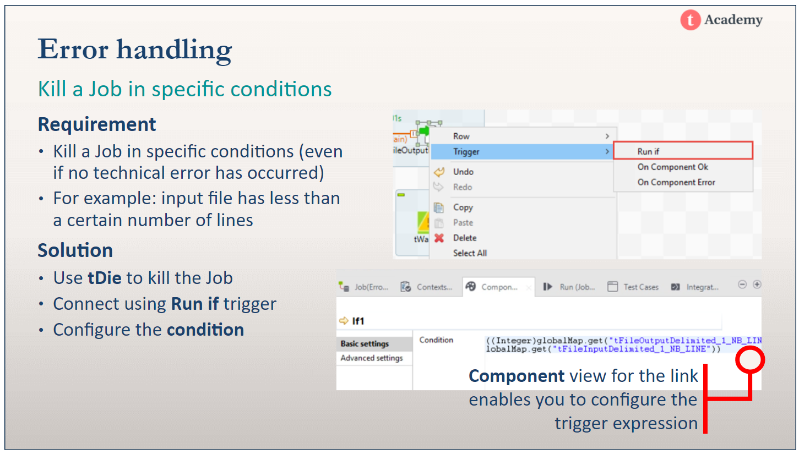
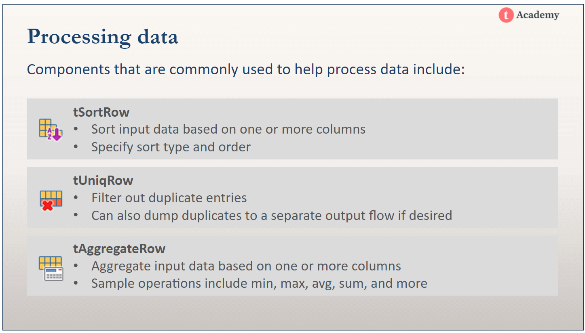

# Talend Data Integration - Basics

TASKS:

Jobs, subjobs and components

- [x] Create a Job 
- [x] Add, connect, and configure components 
- [x] Redesign a Job following best practices 

Files
- [x] Import data from a delimited file
- [x] Create a schema
- [x] Read an XML file, configure the schema and XPath expression to parse an XML file
- [x] Read a JSON file, configure the schema and JSONPath expression to parse a JSON file

Databases
- [x] Connect to a database from a Talend Job
- [x] Write to a MySQL table 
- [x] Read from a MySQL table 
- [x] Extract out database connections into a single component

Using Repository Metadata
- [x] Decide when to use metadata
- [x] Distinguish built-in from Repository properties
- [x] Use different types of metadata in Jobs: file metadata, database metadata, generic schemas
- [x] Update metadata from the Repository and propagate the changes

Processing Data
- [x] Map data input to output using the tMap component
- [x] Join data and collect join rejects
- [x] Filter data and collect filter rejects
- [x] Use expressions and variables in the mapping editor
- [x] Sort and aggregate data using other data processing components

Context variables
- [x] Create built-in context variables that are specific to a Job
- [x] Use context variables in the configuration of Talend components
- [x] Run a Job using context variables
- [x] Connect a Job to a database using context variables
- [x] Create repository context variables that are available for all Jobs
- [x] Load context variables from a flow

Building standalone and Docker images from Jobs
- [x] Build a stand-alone Job
- [x] Run a stand-alone Job outside Talend Studio
- [x] Build a new version of an existing Job
- [x] Build a Job as a Docker image
- [x] Run a Job in a Docker container

Control execution
- [x] Use components to list, archive, and delete files from a directory
- [x] Manage iterations inside a Job
- [x] Reuse component variables to configure other components
- [x] Use triggers to connect components and subJobs
- [x] Create a master Job
- [x] Override context variables for subJobs
- [x] Export a master Job and its dependencies

Error handling
- [ ] Kill a Job on a component error
- [ ] Implement a specific Job execution path on a component error
- [ ] Raise a warning in specific conditions
- [ ] Configure the log level in the console

Web services
- [ ] Use a Talend component to access a web service method
- [ ] Extract specific elements from a web service reply
- [ ] Store Web Services Description Language (WSDL) schemas for use in the tXMLMap component

Case Study: Creating a master sales table from Sales, Product and Customer data
- [ ] Use components to open and close a database connection in a Talend Job
- [ ] Write to and read from a database table
- [ ] Retrieve table schemas in the repository
- [ ] Configure components using metadata
- [ ] Join data using the tMap component
- [ ] Filter unique data rows
- [ ] Aggregate data and perform calculations
- [ ] Write data to an XML file
- [ ] Orchestrate several Jobs inside a master Job
### Key terms
Component - a predefined unit of Java code that performs specific operations on data (implementation is hidden by default)
Job - comprises one or more SubJobs
SubJob - comprises one or more connected components performing a specific task
Row - carries data to the next component
Trigger - transfers proccessing control to the next component or SubJob 
### A simple ETL job



### Creating a Job

Job Designs -> right click -> create job

Adding a component

1. click in the designer and type in the name of a component
2. drag a component from the palette and place in designer

Linking components

1. rClick first component
2. Select row
3. Select main
4. Select second component to link to 


Renaming components

1. Select component
2. View tab
3. Label format

Help page
1. Click component
2. F1

### Talend components 

- [ ] tLogRow
- [ ] tPostjob
- [ ] tDBClose
- [ ] tDBInput
- [ ] tDBConnection
- [ ] tFileInputDelimited
- [ ] tFileInputJSON
- [ ] tFileInputXML


Main row

Main rows pass the data flow from one component to another, iterating on each row and reading input data according to the component’s properties setting.

Schemas
Schemas logically assemble and group data that will be read and processed by a component.

### Repository Metadata

Metadata is stored in the Repository and can be reused across jobs and components.

Built-in data - properties specific to a component
Repository properties - properties stored in the repository that can be reused

Generic schemas - can be used by any component; often  used to configure components of different types with the same schema

Changes to the repository metadata can be selectively propogated to all jobs and components making use of that metadata.

Changing the Property Type of a component to built-in severs the link between that component and the repository metadata.

Use impact analysis before updating metadata to see which jobs and components will be impacted.

Consider duplicating frequently updated metadata to keep a master copy.

Use context variables in the definition of metadata to update metadata through updating the context setting.

Some types of metadata
- delimited/XML/JSON file metadata
- database metadata
- generic schemas


### Processing data

tMap - use for joining data, mapping data
tAggregateRow - use for aggregate functions with group by
tSortRow - sorting rows
tSelectRow - selecting n-many rows from a table

### Context variables

Context variables let us configure environment variables so we can set up different execution environments like test, development and production environments.

tContextLoad - override context variables for a Job
tContextDump - export context variables

### Building executables and Docker images from Talend Studio Jobs

Exported jobs can only run on other Talend instances.
Built jobs are standalone jobs that can run anywhere.

You can build jobs that run on Windows, Linux and in Docker containers.
Build a job as an executable that can run on Windows or Linux or as a Docker image.

Docker 
- The Daemon is the the docker component that manages containers
- The Docker CLI runs on your local machine and lets you interface with the Daemon
- Docker images contain your Job and everything it needs to run (They're like a template or schema for creating containers)
- A container is a running instance of your Docker image

A standalone job contains:
- JAR files (which are Java based zip files)
- Files needed for deployment
- Contexts and variables
- BAT files (batch execution files for starting Jobs on Windows)
- SH files (Linux shell scripts for launching Jobs)

Building a Docker images requires:
- Connection to Docker host
- Image name and tag

Image name is the Job name and location in your Repository
Tag is the Job version (lets you distinguish between different versions of a Docker image created from the Job)


Docker CLI 
```cmd
<!-- view docker host info -->
docker -H dockerhost info

<!-- view docker images -->
docker -H dockerhost images

<!-- view running containers -->
docker -H dockerhost ps

<!-- running docker images -->
docker -H dockerhost run <image_name> [--context=selectcontext]
```

Control execution


tFileList - iterates over files in a directory
Use iterate connection with tFileList to loop a process on files stored in a directory




Error handling

Die-on error - stops the Job when an error is encountered in the component
Triggers - tranfer control based on subjob and component status
Kill a job - use the tKill component to kill a job when a specified condition is met
Warning - use the tWarn in the same way as you would use a tKill, but you get a warning message instead of killing the job.
log4jlevel - configure which messages to log to the console



Web services

tESBConsumer - for accessing web services
tXMLMap - mapping the XML response and configuring it to be used in data integration flow


Case Study: Sales, Products and Customers




