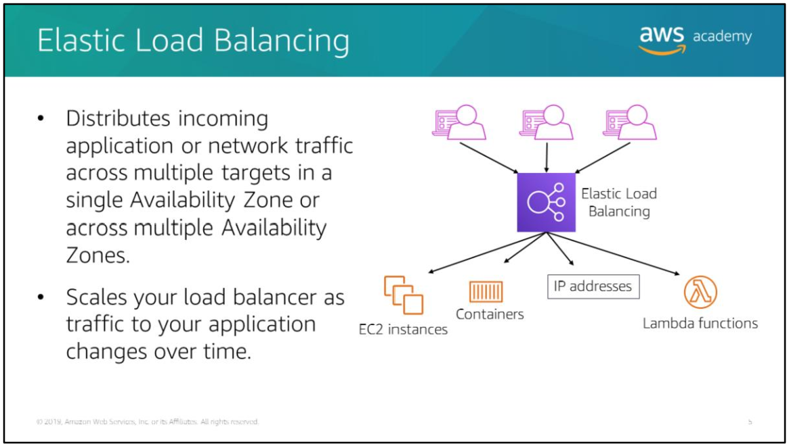
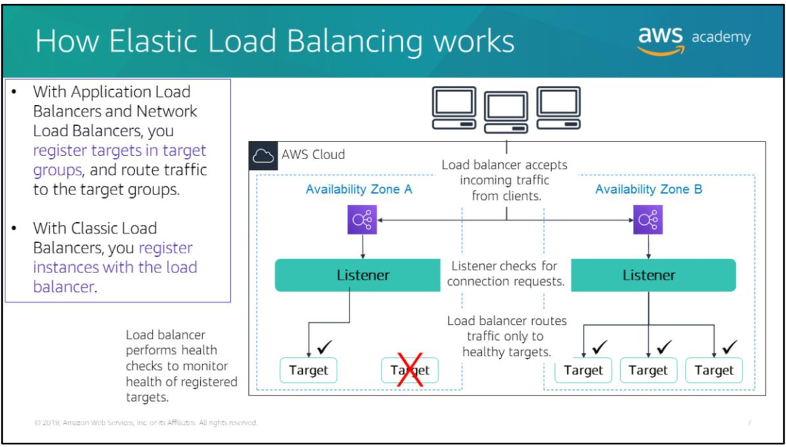
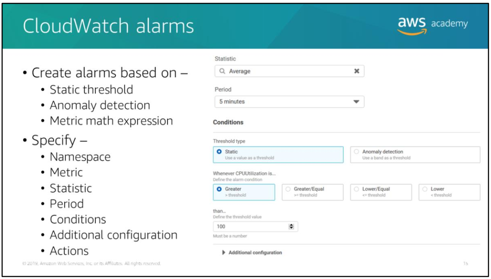
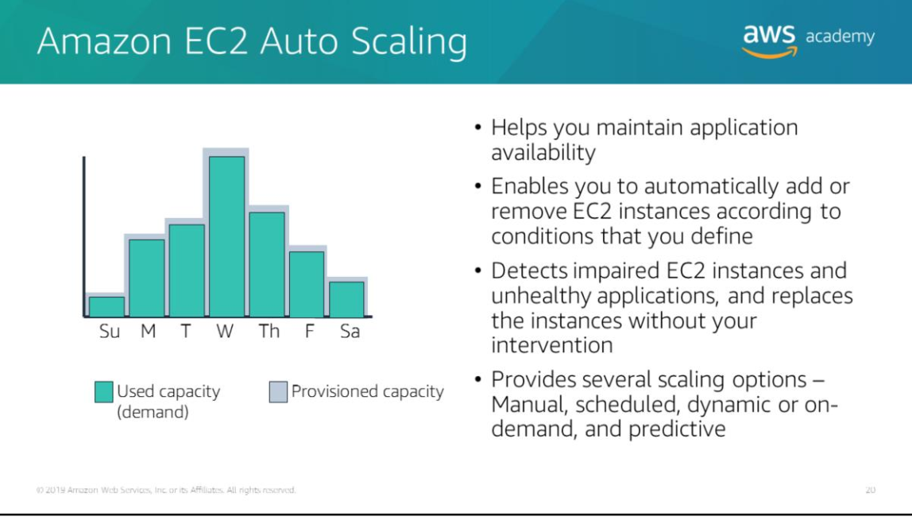
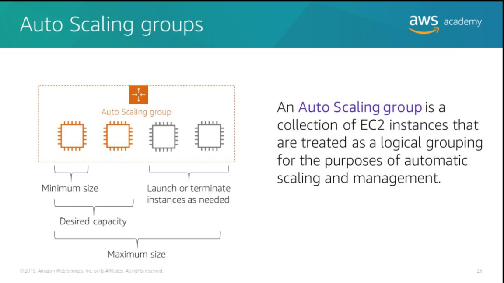

---
export_on_save:
  html: true
---

# Section 1: Elastic Load Balancers

Distributes inbound network traffic by routing requests across multiple targets in one or more avalability zones. Targets include EC2 instances within a target group, containers, IP addressses and Lambda functions.

#### Types of elastic load balancers

Application Load Balancer

- Routes traffic to targets based on request content
  
Network Load Balancer

- Routes traffic to targest based on IP protocol data
  
Classic Load Balancer (will be deprecated at the end of 2022)

- Operates at both application level (HTTP(S)) and network level (TCP, SSL).

#### Listeners

- ELBs must have at least one listener configured to accept incoming traffic. 

Listeners are processes that listen for connection requests.

They have a protocol and port number that for clients to connect to the load balancer.

They also have a separate protocol and port number for the load balancer to connect to the targets

You can configure your load balancers to perform health checks to ensure that requests are only sent to healthy instances. The health status of instances will determine whether traffic is routed to them.

Classic Load Balancers differ in how they register targets. Rather then being registered in a target group, they're directly registered with load balancers.

Target groups

Target Groups define where to send traffic that comes into the Load Balancer. 
The Application Load Balancer can send traffic to multiple Target Groups based upon the URL of the incoming request, such as having requests from mobile apps going to a different set of servers

#### Use cases

Fault-tolerance 
- traffic to unhealthy instances are routed to healthy targets in either the same or different availability zones

Containerisation
- Elastic Load Balancers support balancing traffic across different ports on the same EC2 instance. Can be integrated with ECS (Elastic Container Service)
  
Elasticity and Scaling
- when new EC2 instances are provisioned, Elastic Load Balancer will automatically register them as targets to which traffic can be directed

VPC
- Elastic Load Balancers can be used as entry points to your VPC; they can also be used to route traffic between tiers of your application within a VPC.

Hybrid load balancing
- You can use Elastic Load Balancers to distribute traffic between AWS resources and on-premises resources.
- You can use a single load balancer by associating all the resouces with a single target group and associating the target group with a load balancer
- You can use separate load balancers for AWS and on-premises resources using DNS-based weighted load balancing

Invoking Lambda functions over HTTP(S)
- Elastic Load Balancers work with Lambda functions to offer traffic distribution for serverless applications
- HTTP(S) Requests can be sent to Application Load  Balancers to invoke different Lambda functions.
- Application Load Balancers can also be used as a common HTTP endpoint for applications that use servers and serverless computing

#### Monitoring Load Balancers

CLoudWatch metrics
- Elasic Load Balancing publishes data points to Amazon CloudWatch for your load balancers and targets. You can retrieve statistics about those data points as an ordered set of time series data to verify that your system is performing as expected.
- Set up CloudWatch alarms to trigger actions like sending notification emails using AWS SNS when a monitored metric goes outside a user-specified range.

Access logs
- store access logs that capture detailed information about requests made to your load balancers in AWS S3. 
- Use these access logs to analyse traffic patterns and troubleshoot issues with targets/backend apps.

CloudTrail logs 
- capture detailed information about requests made to your Elastic Load Balancing API and store them in AWS S3
- Use these logs to learn more about the API calls made to your Elastic Load Balancing API 

# Section 2: AWS Cloud Watch

Monitors your AWS resources and your applications running on AWS resources in real time.

Collect and track metrics with CloudWatch to measure your resources and applications.

You can use Amazon Simple Notification Service (SNS) to send automatic alerts based on CloudWatch alarms. For example, you can use CloudWatch alarms to initiate EC2 Auto Scaling based on the CPU utilisation of an EC2 instance breaching a preset threshold. 

You can set up alarms based on Elastic Load Balancing request latency, DynamoDB table throughput, changes to your AWS bill etc.

Pricing is based on how much you use and charges are applied at the end of each month.

#### Creating CloudWatch alarms

Namespace - the metric you want, e.g. EC2
Metric - variable you want to measure
Statistic - the aggregation function (avg, sum, min, max, count) etc.
Period - the the evaluation period for the alarm.
Conditions - conditions that a static threshold need to meet to trigger the alarm. E.g. >, >=, <=, <
Additional configuration information - how to treat missing data, number of data points within the evaluation period that must be breached for an alarm to be triggered
Actions - what to do if an alarm is triggered. E.g. send an alert via Amazon SNS, perform EC2 auto scaling etc.

# Section 3: EC2 Auto Scaling

Scaling 

Responds to changing conditions by adding or terminating instances

A collection of EC2 instances managed together for autoscaling. This is only a logical grouping as EC2 instances part of the same Auto Scaling can be in different availability zones.

Auto-scaling

Useful for predictable workloads - reduce capacity during non-working hours like 

Also useful for unpredictable workloads - reduce capacity on-demand such as for seasonal traffic

#### Auto Scaling Groups

The size of an Auto Scaling group depends on the number of instances you set for the desired capacity.

Setting up scaling policies lets EC2 Auto Scaling launch and terminate instances automatically as demand on your application fluctuates.

Launching instances is denoted by 'scaling in'
Terminating instances is denoted by 'scaling out'

#### Setting up EC2 Auto Scaling Groups

The instance configuration is what is being scaled by EC2 Auto Scaling groups.

> Step 1 : Configure your instance configuration

The instance configuration includes:
- ID of a specified Amazon Machine Image (AMI)
- Instance type
- IAM role
- Security groups
- EBS volumes

> Step 2 : Configure your auto-scaling group

Then you can enforce a minimum and maximum number of running EC2 instances within an EC2 auto-scaling group.
- Can specify a min group size and a max group size 
- Can specify your desired capacity
  
> Step 3 : Select where you want to launch your EC2 Auto Scaling group

Select a VPC subnet in which to launch your EC2 Auto Scaling group.

You can attach Elastic Load Balancers to your EC2 Auto Scaling group and incoming traffic will be automatically distributed across instances within that group.

Scaling options
- maintain the current number of instances at all times
  - EC2 Auto Scaling will periodically check the health status of instances within the group and maintain the number of healthy instances 
- manual scaling
  - configure the max, min and desired number of instances
- scheduled scaling
  - configure scaling based on date and time
- dynamic, on-demand scaling
  - define parameters to control the scaling process
  - e.g. ensure that the CPU utilisation rate of all instances are close to 50%
  - integrate with CloudWatch alarms to trigger scaling in response to alarms
- predictive scaling
  - use AWS Auto Scaling to predict your application demand and then configure your EC2 Auto Scaling to use this prediction as a basis for scaling
  - prediction data is drawn from actual EC2 usage and AWS' machine learning models are used to estimate your expected traffic 

### Example dynamic scaling configuration

### AWS Auto Scaling

AWS Auto Scaling is a separate service that helps you monitor and scale your applications.

It automatically adjusts capacity to maintain steady, predictable performance at the lowest cost. 

It provides a user interface to help you build scaling plans for resources such as:

- EC2 instances and Spot Fleets
- Elastis Container Service (ECS) tasks
- DynamoDB tables and indexes
- Aurora Replicas