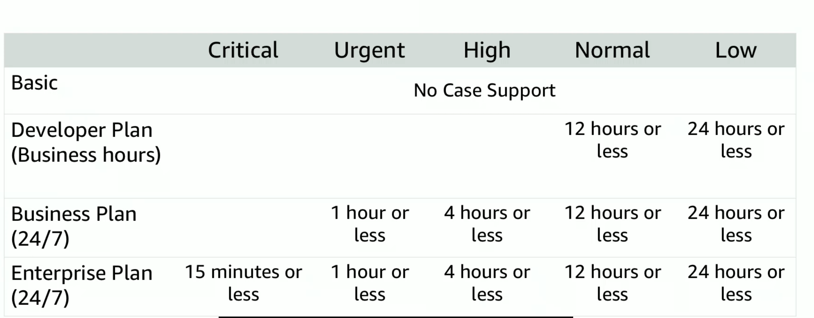

---
export_on_save:
  html: true
---
### Payment
- You pay for what you use.
- You pay less when you use more and when AWS grows (economies of scale)

### Volume based discounts
- As your storage usage increases, the less you pay per GB of storage
- Tiered pricing for storage services like AWS S3
- You can choose the best combination of AWS storage solutions to lower storage costs 

As AWS grows, future higher-performing resources replace current resources for no extra charge

### Custom pricing
- High volume projects with unique requirements

AWS Free Tier for 1 year

### Services with no charge
- Amazon VPC
- Elastic Beanstalk
- Auto Scaling
- AWS CloudFormation
- AWS Identity and Access Management (IAM)

### Total Cost of Ownership

- What it costs to setup and run the solution
- Financial estimate to help identify direct and indirect costs of a system

- We can compare entire infrastructure environment or workload on-premises vs on AWS
- To budget and build a case for moving to the cloud

- Server costs
- Storage costs
- Network costs
- IT Labour costs

More indirect costs to consider for on-premise solutions 

### AWS Pricing Calculator
- Estimate monthly costs
- Identity cost reduction opportunities
- Model solutions before realising them
- Explore price points
- Find the best instance types to meet your needs

#### Reading price estimate
- first 12 months total 
- total upfront - how much you pay upfront to set up your stack
- total monthly - how much you each month to run your AWS stack

#### Hard benefits
- Reduced spending on compute, storage, networking, security
- Reduced hardward and software purchases
- Reduced operationalcosts, back up and disaster recovery
- Reduced operations personnel

#### Soft benefits (difficult to quantify)
- Reuse services and applications to define and redefine solutions using the same cloud solutions
- Increased developer productivity
- Agile businesses can quickly respond to new and emerging opportunities
- Increase in global reach 
### Billing

AWS Organisations for grouped billing of multiple AWS accounts 

AWS Accounts are organised into OUs(Organisation Units)
OU's are branches of accounts and other OU's

IAM (Identity Access Management) policies apply to services, users, groups and roles. It can't be used to restrict AWS accounts

SCP (Service Control Policies) apply to individual AWS Accounts and OUs to control their access to AWS services. This affects all users, groups, roles falling under each OU.

### Accessing AWS Organisations
- AWS Management Console
- AWS CLI
- SDK
- HTTPS Query APIs

### AWS Billing and Cost Management

AWS Billing Dashboard shows you what you're spending the most on and your spending trends at different levels of granularity. It also predicts your costs for future months based on your past usage.

Tools include:
- AWS Budgets
- AWS Cost and Usage Report
- AWS Cost Explorer
- AWS Bills page

Provides up-to-date info of the costs of the serivces you are using.
You can send billing reports to S3.

### Technical Support

Proactive guidance
- Technical Account Manager (TAM) provide guidance and technical reviews, ongoing communication (Enterprise Support Plan)

AWS Trusted Advisor
- Automated service that identify problems in your cloud architecture 

Account assistance
- AWS Support Concierge

### 4 Support Plans
1. Basic (free)
2. Developer 
3. Business
4. Enterprise

Costs for services with reserved capacity:
1. AURI (All up front)
2. PURI (Partial up front)
3. NURI (No up front)