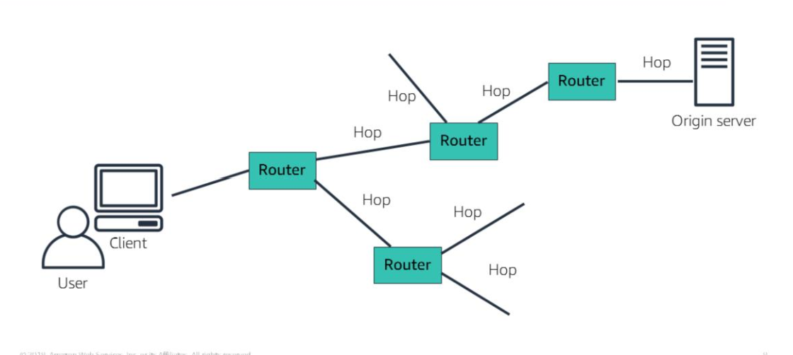
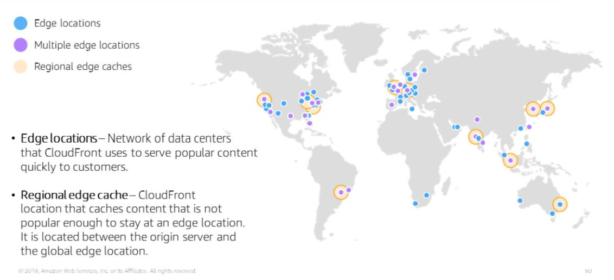

---
export_on_save:
  html: true
---
# Section 6: AWS CloudFront

A content delivery network (CDN) service

Is a solution to the performance challenges of network communication when a request is routed through many different networks to reach the original server. 

With each router and with increasing distance, the performance and responsiveness of the requested resource decreases.

### What's a CDN

- globally distributed system of caching servers
- they cache static contents like HTML, CSS, JavaScript and static images hosted on application servers
- they deliver a local copy of the requested content from a cache edge or Point of Presence to provide fast delivery of content

They can also deliver dynamic content unique to the requesting client that cannot be cached. 

Because CDN maintains secure connections closer to the client, delivering dynamic content improves the application performance and scaling.

If a CDN is on the same network as the application origin server, routing to the origin to retrieve dynamic content is accelerated.

### Amazon CloudFront

- Low latency, high transfer speed, global and secure CDN service
- Developer friendly 
- Uses a global network of edge locations and Regional edge caches

Edge locations - networks of data centers designed to serve popular content asap to viewers.

Regional edge caches - caches less popular content. Has a larger cache than individual edge locations. 

Together they ensure more of your content remains closer to users, reducing the need for CloudFront to fetch data from your origin server, thus improving overall performance for users.

Helps improve performance by using Keep-alive connections between the Edge locations & the origin server.

Can customise content at the Edge location before delivering it to users through the use of Lambda@Edge functions. 

Geolocation headers can be used to provide location-based web personalisation. This gives you greater control over cache behaviour. Your origins also get access to the requester's country name, region, city, postal code, latitude and longitude based on their IP address.
### Origins

Origins are locations where content is stored and retrieved by CloudFront to serve to clients

Use S3OriginConfig to specify an Amazon S3 bucket that is not configured with static website hosting.

Use CustomOriginConfig to specify all other kinds of origins, including:

- An Amazon S3 bucket that is configured with static website hosting

- An Elastic Load Balancing load balancer

- An AWS Elemental MediaPackage endpoint

- An AWS Elemental MediaStore container

- Any other HTTP server, running on an Amazon EC2 instance or any other kind of host

### Benefits

- Fast and global

- Integrated with AWS

- Secure
Amazon CloudFront provides both network-level and application-level protection. Your traffic and applications benefit through various built-in protections, such as AWS Shield Standard, at no additional cost. You can also use configurable features, such as AWS Certificate Manager (ACM), to create and manage custom Secure Sockets Layer (SSL) certificates at no extra cost

- Programmable
It integrates with Lambda@Edge so that you can run custom code across AWS locations worldwide, which enables you to move complex application logic closer to users to improve responsiveness. The CDN also supports integrations with other tools and automation interfaces for DevOps. It offers continuous integration and continuous delivery (CI/CD) environments

- Economical
Charged according to what you use.
If you use AWS origins such as Amazon Simple Storage Service (Amazon S3) or Elastic Load Balancing, you pay only for storage costs, not for any data transferred between these services and CloudFront

### CloudFront Pricing

- Data egress charges

Charged per GB of data transferred from CloudFront edge location to the internet or to your origin.
Costs are calculated by geographic region

- Number of HTTP requests made to CloudFront
- Dedicated IP custom Secure Sockets Layer (SSL) 
  
You pay $600 per month for each custom SSL certificate that is associated with one or more CloudFront distributions that use the Dedicated IP version of custom SSL certificate support. 