---
export_on_save:
  html: true
---
# Section 2: Networking basics
### Computer networks
- two or more client machines connected together for the purpose of sharing resources
- we can partition networks into subnets(subnetworks)
- routers or switches are needed to connect client machines together for networking

### IP addresses (Internet Protocol address)

- unique identifiers for client machines
- numeric label in decimal format which is converted into binary format

#### IPv4 (32bits)

- e.g. 192.2.1.0
- Four numbers separated by dots.
- Each number is in octal number format
- Each 8bit number ranges from 0 to 255.

#### IPv6 (128bits)

- e.g. fr80::599f:a54f:ab4d:a7gc
- accommodate more user devices
- Eight groups of 16bit letters or numbers separated by colons.
- Each group is in hexadecimal format and ranges from 0 to FFFF $(0$ to $2^{16})$.

### CIDR (Classless Inter-Domain Routing)

Structure

1. IP address 
2. forward slash
3. number specifying how many bits of the routing prefix must be fixed or allocated for the network provider.

Examples.
With 192.0.2.0/24
First 24 bits must be fixed, so we can have 192.0.2.0/24 to  192.0.2.255/24

With  192.0.2.0/8 we can have 192.0.0.0/8 to  192.255.255.255/8

192.0.2.0/32 is a fixed IP address, which can be useful for setting up firewalls.
0.0.0.0/0 is the IP address of the internet

### OSI (Open Systems Interconnection) Model

Model conceptualising how data moves through a network. Depicts 7 transport layers and their typical protocols.

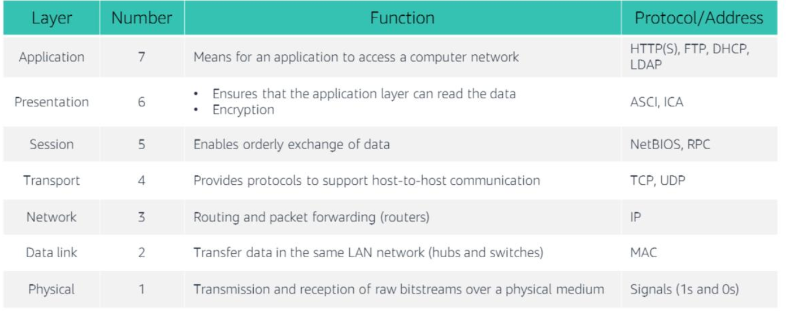

### Amazon VPC

You can provision a logically isolated section of the AWS Cloud where you can launch your AWS resources

- virtual networking resources
- IP addresses (IPv4 and IPv6)
- create subnetworks
- configure route tables
- configure network gateways

### VPC and subnets

- VPCs belong to a single AWS Region and can span multiple Availability Zones.
- VPCs can be subdivided into multiple subnets, which are a range of IP addresses.
- Each subnet belongs to a single availability zone.
- Each subnet is either public or private.
- Public subnets have direct access to the internet.

An IPv4 CIDR block (range of IPv4 addresses) is assigned to a VPC upon creation. This address range cannot be changed after being assigned.

This ranges from /16 (wide range) to /28 (narrow range) different IP addresses.
You have the option to assign an IPv6 CIDR block with your VPC and subnets.

Each subnets requires its own CIDR block.
The CIDR block for a subnet can be a subset of the CIDR block for the VPC. 
CIDR blocks must be disjoint because you cannot have duplicate IP addresses in the same VPC.

### Reserved IP addresses

For each CIDR block, 5 IP addresses are reserved:

| Reserved IP address | Reserved For              |
| ------------------- | ------------------------- |
| x.x.x.0             | Network address           |
| x.x.x.1             | Internal Communication    |
| x.x.x.2             | DNS resolution            |
| x.x.x.3             | Future use                |
| x.x.x.255           | Network broadcast address |

### Public IP addresses

Private IP addresses are automatically assigned to VPC instances.
Public IP addresses can be assigned by modifying the subnet's auto-assign public IP address properties.

Elastic IP address - static public IPv4 address designed for dynamic cloud computing; they can be associated with VPC instances or VPC network interfaces

Associating an Elastic IP address with a network interface for a VPC belonging to your account allows for interfacing with multiple VPC instances without having to change their IP address.

### Elastic network interface

- virtual network interface that can be attached and detached from VPC instances 
- its attributes follow when it is reattached to new instances
- each instance in a VPC has a default/primary network interface that is assigned a private IPv4 address within the IPv4 CIPR block range. While this primary network interface cannot be detached, you can attach additional network interfaces.

### Route tables and routes

A route table contains a set of rules that govern how network traffic from your subnet is directed. We call this set of rules routes. Each route has a destination and target: destination denotes the CIDR block to which you want traffic from your subnet to go; target denotes the target through which the traffic is sent through.

The local route is included by default with each route table and is used for internal communication within the VPC. This route cannot be deleted.

Every subnet in your VPC must be associated with a route table and only one such table at any point in time. 

The same route table may be used for multiple subnets.

The main route table is the route table that is automatically assigned to your VPC and contains routing for all subnets not explicitly associated with any route table.

E.g. Main Route Table
| Destination | Target |
| ----------- | ------ |
| 10.0.0.0/16 | local  |

# Section 3: VPC networking
### Internet Gateway

An internet gateway is a scalable, redundant, and highly available VPC component that allows communication between instances in your VPC and the internet.

It serves 2 purposes:
1. Provide a target in your VPC route tables for internet-routable traffic
2. Perform Network Address Translation for instances that were assigned public IPv4 address blocks

Attach an internet gateway to your VPC
Add a route to the route table with the internet(0.0.0.0/0) as its destination and the internet gateway as its target.
E.g.
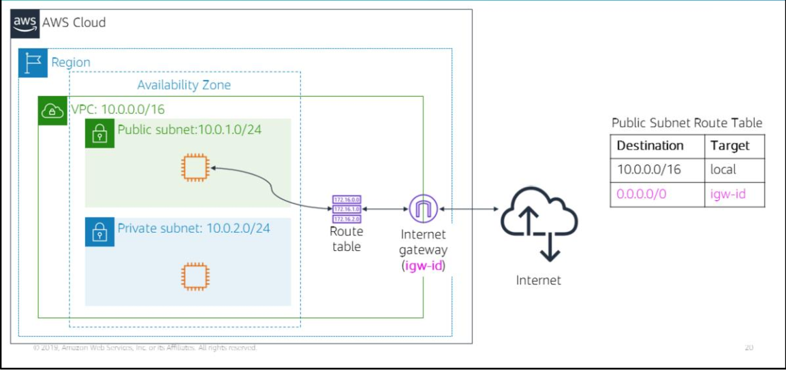

### NAT (Network Address Translation) gateway

NAT gateways allow instances part of a private subnet to make a one-way connection to the internet and other AWS services.

NAPs translate private IP addresses against a public IP address. Traffic to the private IP address is then mapped to its associated public IP address. This allows instances within a private subnet to connect to the internet.

1. Specify the public subnet in which the NAT gateway resides.
2. Update the route table associated with your private subnet that contains the instance that you want to connect to the internet so that the target of its route points to the NAT gateway

NAT instances are an alternative to NAT gateways, but AWS recommends NAT gateways for most use cases due to higher availability, bandwidth and less admin effort.

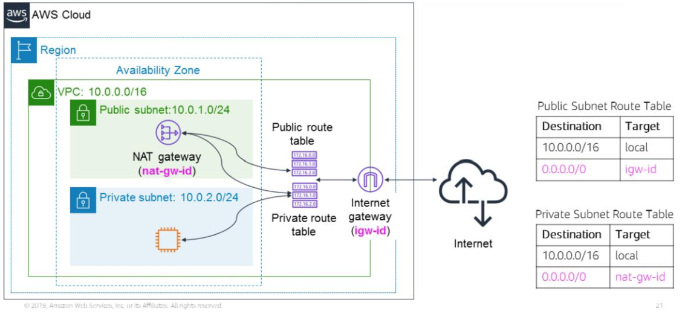

### VPC sharing

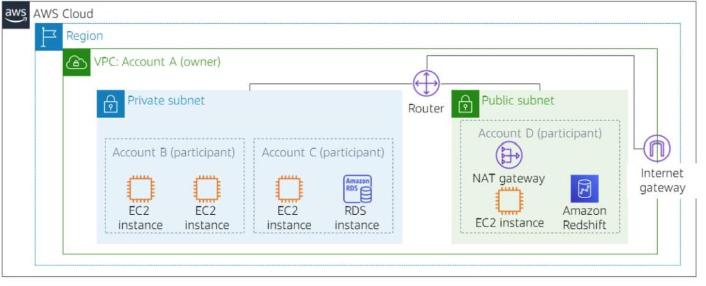

VPC sharing enables subnets to be shared between AWS accounts part of the same AWS Organisation.

This allows for different AWS accounts to create their applications resources like compute, storage and database services and share them with each other via a central VPC managed by their AWS Organisation. 

For example, here is one way of making use of VPC sharing. The AWS Account that owns the VPC can share subnets with other accounts in the same AWS Organisation and participants can perform CRUD operations with their application resources in the subnets shared with them. 

- Networks are decoupled from accounts - I don't need account X to access network K; network K can be shared with me while I use account Y.
- More use gotten out of fewer, larger VPCs

### VPC peering

VPC peering connections are networking connections between two VPCs that enables you to route traffic between them privately.

In setting up the peering connection, routes need to be created in the route tables for both VPCs.

- IP address ranges cannot overlap between the two VPC's (this follows from how the two VPCs communicate as though they were part of the same network and that IP addresses are unique identifiers)
- Transitive peering isn't supported (Peering connections between VPC A and VPC B and between VPC B and VPC C doesn't imply a peering connection between VPC A and VPC C)
- A VPC peering connection can only connect one resource between two VPCs

### Site-to-Site VPN

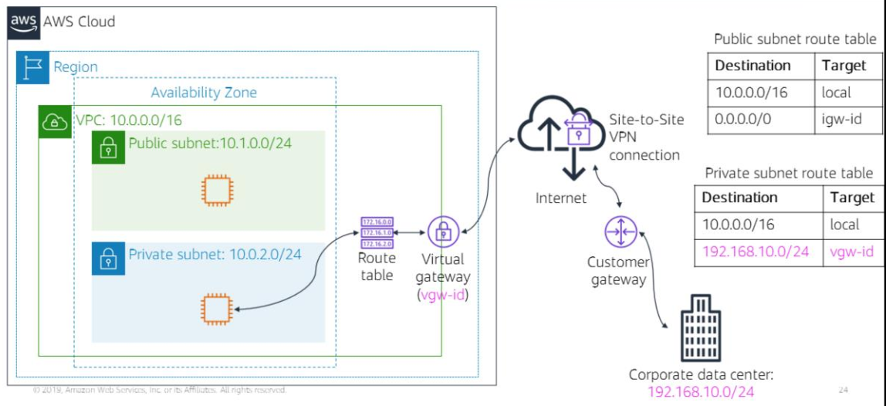

Steps to connect your VPC to a remote network (VPN)
1. Create and attach a virtual gateway device(VPN gateway) to your VPC
2. Configure the customer gateway (this gateway provides information about your VPN device to AWS)
3. Create a custom route table and set the target field of traffic destined for the corporate data centre to be the virtual gateway. (Update security group rules)
4. Establish an AWS Site-to-Site VPN connection to link the customer gateway and the virtual gateway.
5. Configure routing to pass traffice through the connection

### AWS Direct Connect

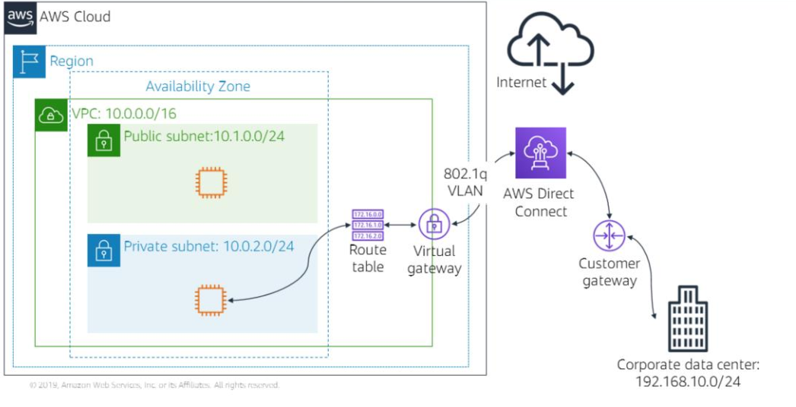

Direct Connect enables you to establish a dedicated private network connection between your network and one of the Direct Connect locations. 

This reduces network costs, increases bandwidth throughput and provides a more consistent network experience than internet-based connections. 

Very useful for maintaining stable performance when communicating with data centres faraway from your AWS Region.

### VPC endpoints

Virtual devices that enable you to privately connect your VPC to supported AWS services and VPC endpoint services powered by AWS 
PrivateLink.

- Doesn't rely on internet gateways, NAT device, VPN connection or AWS Direct Connect connections
- These connections don't require public IP addresses
- Traffic to and from these VPC endpoints never leaves the Amazon network

There are two types of endpoints
1. Interface endpoints - services powered by AWS PrivateLink. You are charged for creating and using an interface endpoint to a service according to hourly usage and data processing rates.
2. Gateway endpoints - no additional charges. 

### AWS Transit Gateway

Solution for scaling VPC connections across multiple accounts and VPCs.

Rather than configure VPC peering to connect pairs of VPCs, with the Transit Gateway, the networking model is simplified as you simply need to connect each VPC to the Transit Gateway, which services as a central hub for mangaging traffic among all your connected networks. 

Each network only needs to connect to the transit gateway and not to every network that it needs to communicate with.

Any network connected to the Transit Gateway is connected to every network connected to the Transit Gateway.

# Section 4: VPC security

Two VPC firewall options:
1. security groups
2. network access control lists (network ACLs)

Security groups are virtual firewalls for your instances. They control inbound and outbound traffic to your instances.
Each instance can have a different set of security groups assigned to it. 

### Security Groups

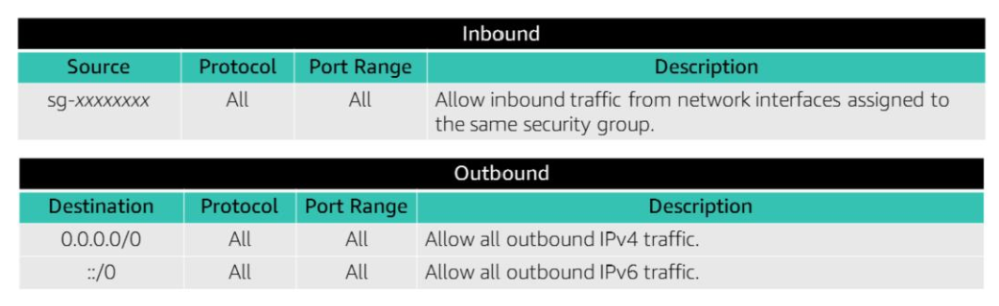

Security groups have rules which control inbound and outbound traffic to instances.
Default security groups allow all outbound traffic and deny all inbound traffic

Security groups are stateful. This means that state information is kept after a request is processed. If you make a request from your instance, then any response sent back to your instance will still be allowed regardless of inbound security groups. Similarly, if you receive a request to your instance, then any responses you sent out from your instance will also be allowed regardless of your outbound security groups.

#### Custom security groups

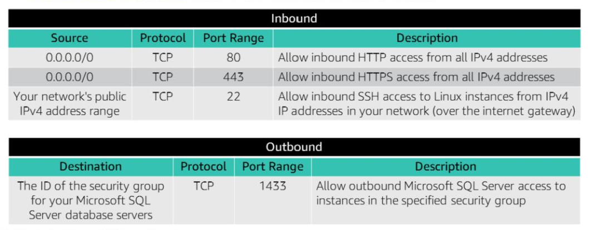

You can only specify rules which govern what kinds of inbound and outbound traffic is allowed.

### Network access control lists (network ACLs)

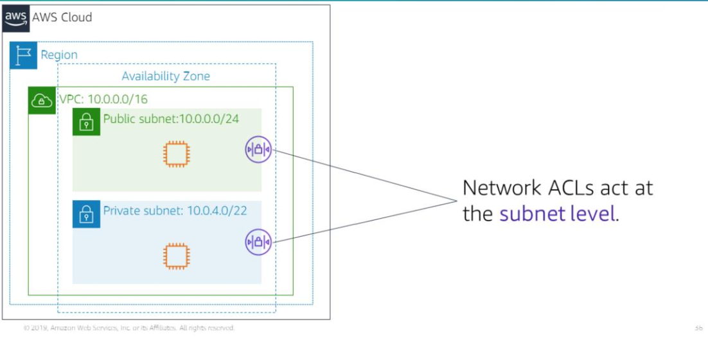

Network ACLs control inbound and outbound traffic for subnets.
They are an optional layer of security for your Amazon VPC.

Each subnet in your VPC needs to be associated with a network ACL, those without an explicit network ACL will be associated with the default network ACL. 

You can use the same network ACL for multiple subnets but each subnet can at most be associated with one network ACL at any point in time. 

Associating a subnet with a new network ACL automatically dissociates it from its previous network ACL.

Network ACL has separate inbound and outbound rules and like security groups, we can specify rules governing which IP addresses, types of traffic, ports can we use to send outbound traffic and receive inbound traffic. However, unlike security groups, we can also specify rules to deny access to certain IP addresses, types of traffic and ports for sending and receiving information.

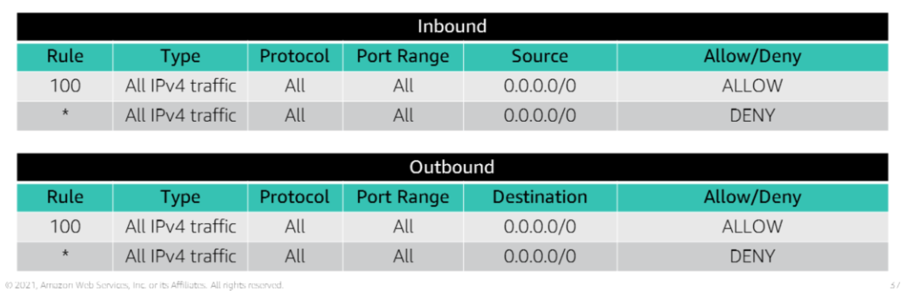

Default network ACLs allow all inbound and outbound IPv4 traffic.

Network ACLs are stateless - no information about requests is kept and maintained after a request has been processed.

### Custom network ACLs

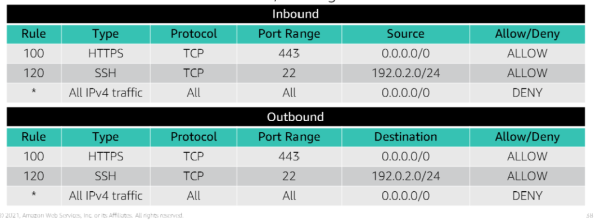

Custom network ACLs deny all inbound and outbound traffic until you specify rules.

Rules numbered and are evaluated in increasing order of their number.
The highest number for a rule is 32,766.
AWS recommends numbering rules at 10 step intervals to allow for the insertion of new rules if needed at a later point.

### Security groups vs Network ACLs

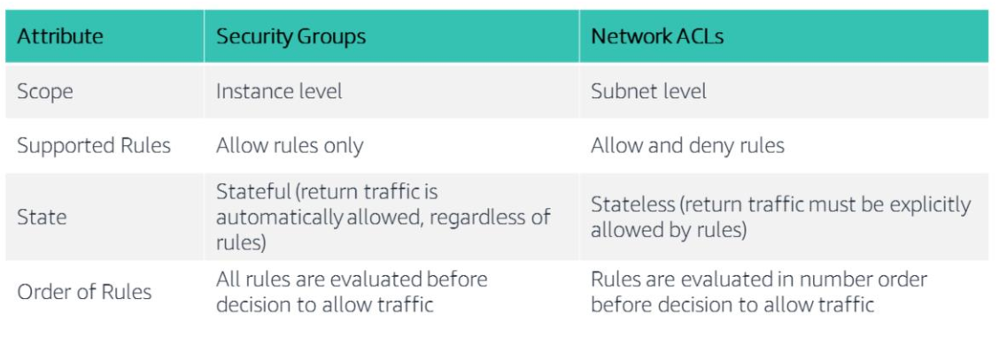
### Design a VPC

VPC - 10.0.0.0/16
	- spans multiple availability zones
Public subnet - 10.2.0.0/16
	- NAT gateway
	- EC2
Private subnet - 10.3.0.0/16
	- Database Server
	- Custom network ACL
Internet gateway
Route tables 
- Public subnet route table

| Destination | Target           |
| ----------- | ---------------- |
| 0.0.0.0/0   | internet gateway |

- Private subnet route table
  
| Destination | Target      |
| ----------- | ----------- |
| 0.0.0.0/0   | NAT gateway |

Security groups
- EC2

| Source    | Protocol | Port Range | Description                                             |
| --------- | -------- | ---------- | ------------------------------------------------------- |
| 0.0.0.0/0 | All      | All        | Allow all inbound HTTP requests from all IPv4 addresses |

Database Server

| Source    | Protocol | Port Range | Description                                                                                  |
| --------- | -------- | ---------- | -------------------------------------------------------------------------------------------- |
| 0.0.0.0/0 | All      | All        | Allow all outbound HTTP requests from all Classless Inter Domain Routing from Private subnet |

