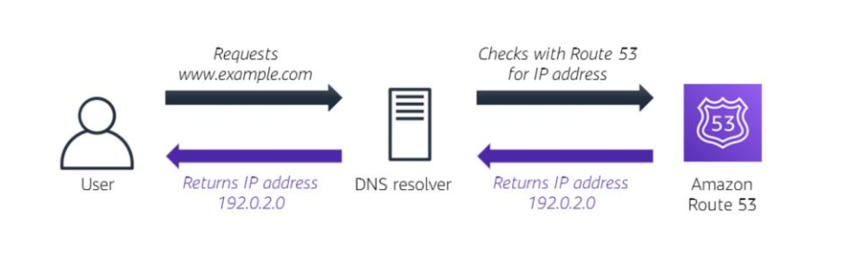
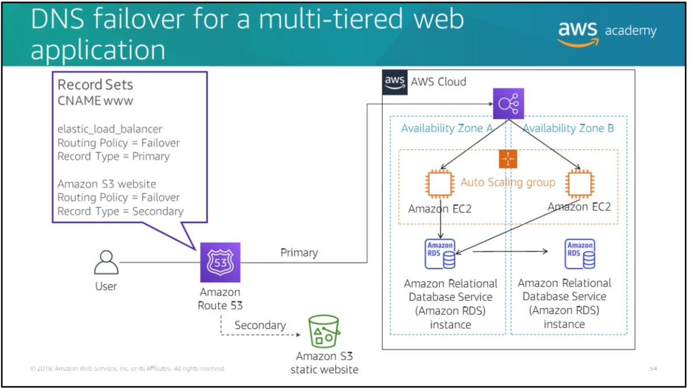

# Amazon Route 53

- highly available and scalable cloud DNS(Domain Name System) service
- routes end users to web applications by translating http addresses (www.domain.com) into IP addresses (190.0.0.0)
- fully compliant with IPv4 and IPv6
- enables you to register domain names and configures your DNS settings automatically
- connects user requests to AWS Services like S3 and EC2
- monitors the health of your resources

- Amazon Route 53 traffic flow’s simple visual editor lets you manage how your users are routed to your application’s endpoints

### How AWS Route 53 handles DNS resolution

DNS resolution is the process of converting domain names into IP addresses

### Routing types supported by Route 53
- Simple routing (round robin)
Use for a single resource that performs a given function for 
your domain (such as a web server that serves content for the example.com website).

- Weighted round robin routing - Use to route traffic to multiple resources in proportions that you specify. Enables you to assign weights to resource record sets to specify the frequency with which different responses are served. You might want to use this capability to do A/B testing, which is when you send a small portion of traffic to a server where you made a software change. For instance, suppose you have two record sets that are associated with one DNS name: one with weight 3 and one with weight 1. In this case, 75 percent of the time, Amazon Route 53 will return the record set with weight 3, and 25 
percent of the time, Amazon Route 53 will return the record set with weight 1. Weights can be any number between 0 and 255.

- Latency routing (LBR) – Use when you have resources in multiple AWS Regions and you want to route traffic to the Region that provides the best latency. Latency routing works by routing your customers to the AWS endpoint (for example, Amazon EC2 instances, Elastic IP addresses, or load balancers) that provides the fastest experience based on actual performance measurements of the different AWS Regions where your application runs. 
  
- Geolocation routing – Use when you want to route traffic based on the location of your users. When you use geolocation routing, you can localize your content and present some or all of your website in the language of your users. You can also use geolocation routing to restrict the distribution of content to only the locations where you have distribution rights. Another possible use is for balancing the load across endpoints in a predictable, 
easy to manage way, so that each user location is consistently routed to the same endpoint. 

- Geoproximity routing – Use when you want to route traffic based on the location of your resources and, optionally, shift traffic from resources in one location to resources in another. 
  
- Failover routing (DNS failover) – Use when you want to configure active passive failover. Amazon Route 53 can help detect an outage of your website and redirect your users to alternate locations where your application is operating properly. When you enable this feature, Amazon Route 53 health checking agents will monitor each location or endpoint of your application to determine its availability. You can take advantage of this feature to increase the availability of your customer facing application. 

- Multivalue answer routing
Use when you want Route 53 to respond to DNS queries with up to eight healthy records that are selected at random. You can configure Amazon Route 53 to return multiple values such as IP addresses for your web servers in response to DNS queries. You can specify multiple values for almost any record, but multivalue answer routing also enables you to check the health of each resource so that Route 53 returns only values for healthy resources. It's not a substitute for a load balancer, but the ability to return multiple health checkable IP addresses is a way to use DNS to improve availability and load balancing. 

### DNS failover example

DNS failover in a typical architecture for a multi-application. Route 53 passes traffic to a load balancer, which then distributes traffic to a fleet of EC2 instances.
Using Route 53 to ensure high availability:
1. Create two DNS records for the Canonical Name Record (CNAME) www with a routing policy of Failover Routing. The first record is the primary route policy, which points to the load balancer for your web application. The second record is the secondary route policy, which points to your static Amazon S3 website.
2. Use Route 53 health checks to make sure that the primary is running. If it is, all traffic defaults to your web application stack. Failover to the static backup site would be triggered if either the web server goes down (or stops responding), or the database instance goes down.