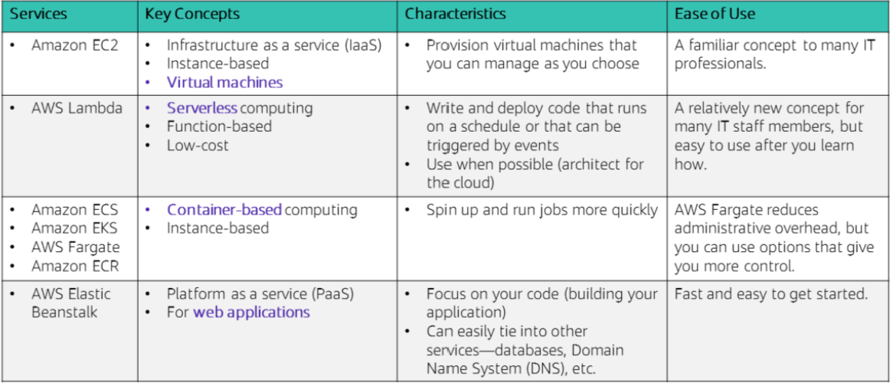
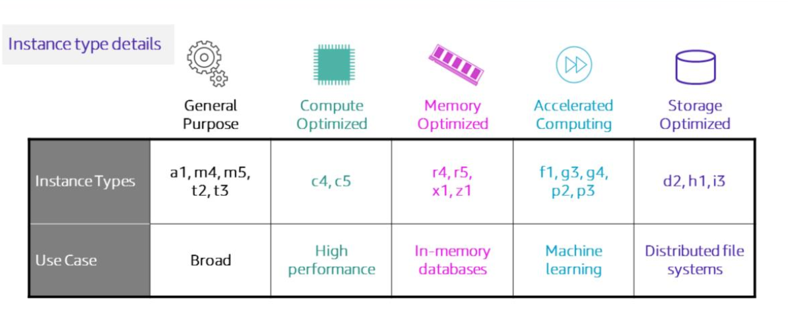
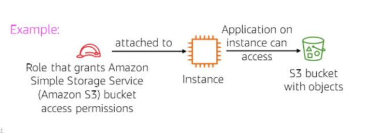
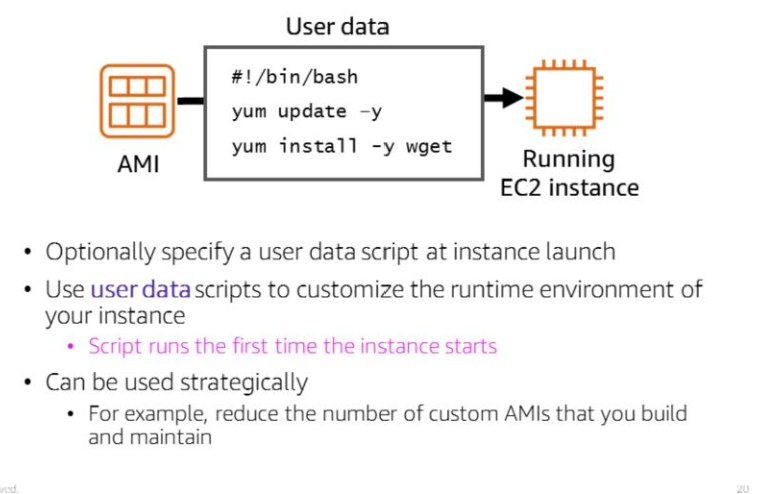
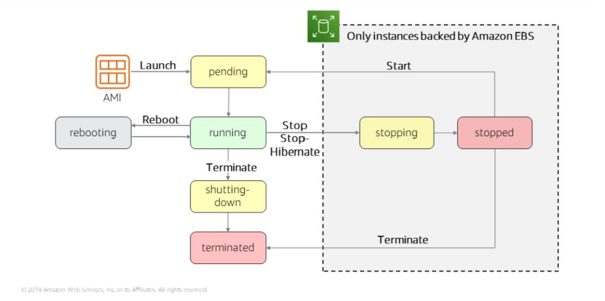
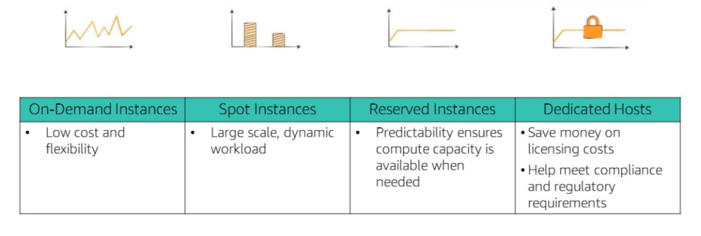
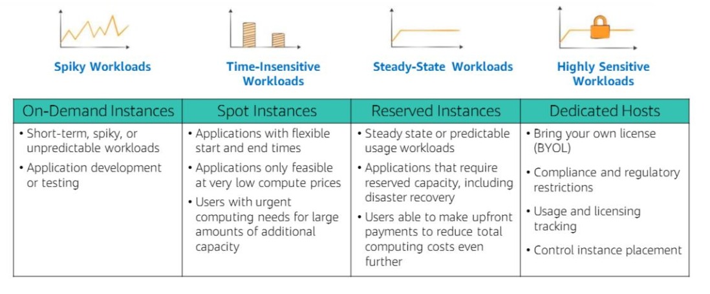
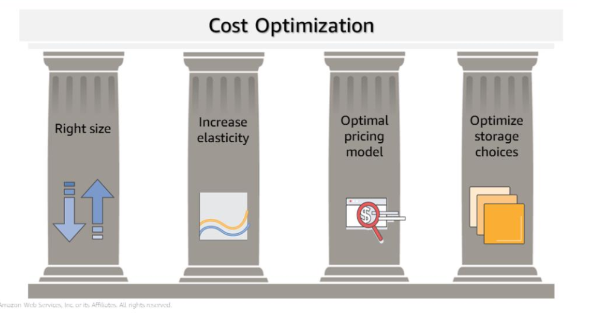

---
export_on_save:
  html: true
---
# Compute services {#pageTop}

Categorisation of compute services



### Selecting a compute service
Best practices
1. Evalute the options
2. Understand the configuration options
3. Collect computer-related metrics
4. Use available elasticity of resources
5. Re-evaluate your compute needs based on metrics

Some things to consider when choosing a compute service:
- Application design
- Usage patterns
- Configuration settings

### Section 2: EC2 (Elastic Compute Cloud)

- Virtual machines that host the same applications that you might run on traditional on-premises servers.
- Secure and resizable compute capacity in the cloud

Elastic - easily scale up or down the number of servers on demand
Compute - hosts applications that require compute resources like processing power (CPU) and memory (RAM)
Cloud - hosted in the cloud

Some example EC2 use cases:
- Web servers
- Database servers
- Game servers
- Mail servers
- Media servers
- File servers
- Computing servers
- Proxy servers

You get full administrative control over either a Windows or Linux operating system running on the instance.

Guest operating system - the operating system that runs on a virtual machine

Host operating system - the operating system installed on the server hardware that hosts virtual machines.

Use virtual machine templates called AMI (Amazon Machine Images) to launch EC2 instances of any size into any availability zone.

Security groups enable you to control your EC2 instance's inbound and outbound traffic; they can only be configured for instances in "running" or "stopped" state, not in the "hibernate" state.

### Launching an EC2 instance

**Step 1: Select an AMI (Amazon Machine Image)**

AMI enable you to launch multiple instances.
Select your virtual machine template. This involves choosing your OS, either Windows or Linux. It also comes with pre-installed software.

#### AMI components
- template for the root volume of the instance. The root volume includes an OS (operating system) and everything installed in the OS (applications, libraries, etc.). EC2 copies the template to the root volume of the new EC2 instance.
- Launch permissions - determine which accounts are permitted to use the AMI.
- a block device mapping - this specifies which volumes to attach to the instance when it is launched

#### Types of AMIs
Quick Start - select from prebuilt AMIs
My AMIs - AMIs you have created
AWS Marketplace - select from a digital catalogue of software solutions
Community AMIs - AMIs created by people all over the world.

#### Creating an AMI
1. Import or start with an existing AMI and use it to launch an instance (we call this an unmodified instance)
2. Configure the unmodified instance in the way you want (this is now a modified instance)
3. Capture the modified instance as a new AMI. (a snapshot of its volume is made and is registered as a new AMI during which the EC2 instance is stopped)
4. The newly registered AMI can be used to launch instances in the same Region. Copy this AMI to other Regions if you want to launch instances in those Regions.

**Step 2: Select an instance type**
   
Your instance type determines 
- memory (RAM)
- processing power (CPU)
- disk space and type (Storage)
- network performance


Instance type categories
- general purpose
- compute optimised
- memory optimised
- storage optimised
- accelerated computing

EC2 instance type nomenclature



e.g. t2.micro

The 2nd generation of the T family.
In general, the larger the generation number, the better value for money and the greater the power the instance.

- t denotes the family name
- 2 denotes the generation number
- micro denotes the size

t2.2xlarge has twice the vCPU and memory of a t2.xlarge and a t2.xlarge has twice the vCPU and memory of a t2.large.

Network bandwith is tied to EC2 instance size.

T3 instances provide burstable performance general purpose instances that provide a baseline level of CPU performance with the ability to burst above the baseline. Use cases for this type of instance include websites and web, development 
environments, build servers, code repositories, microservices, test and staging environments, and line-of-business applications.

C5 instances are optimized for compute-intensive workloads, and deliver cost-effective high performance at a low price per compute ratio. Use cases include scientific modeling, batch processing, ad serving, highly scalable multiplayer gaming, and video encoding.

R5 instances are optimized for memory-intensive applications. Use cases include high-performance databases, data mining and analysis, in-memory databases, distributed web-scale in-memory caches, applications that perform real-time of 
big data, Apache Hadoop or Apache Spark clusters, and other enterprise applications

Each instance comes with a documented network bandwith(Gbps)

By default AWS EC2 tries to spread out your instances across the underlying hardware when you create many instances at once.

But you can use placement groups to influence the placement of a group of interdependent instances to meet your compute needs.

Some instance types will allow you to configure enhanced networking to get higher packet per second (PPS) performance, lower delay variation in the arrival of packets over the network (network jitter) and lower latencies. Consult the Elastic Network Adapter (ENA) for more information.

**Step 3: Specify network settings**

Choose your Region before you start the Launch Instance Wizard by ensuring you are on the correct Region page before you select 'Launch Instance'.
A public IP is automatically assigned when you launch an EC2 instance inside a default VPC. 

For instances launched in nondefault VPCs, AWS doesn't assign a public IP address in nondefault subnets.

Either modify the public IP addressing attribute of your subnet or enable/disable the public IP addressing feature during instance launch to control whether your instances get assigned a public IP address from the public IPv4 address pool.

**Step 4: Attach an IAM (Identity Access Management) role (Optional)**

Attach AWS IAM roles to EC2 instances to grant applications running on EC2 instances permission to interact with other AWS Services like through API calls.

The instance profile is a container for IAM roles.

Attaching IAM roles can be done after an instance has launched; we can attach them to existing instances.



**Step 5: User data script**

By default, user data only runs the very first time that an instance starts up.

You have the option to pass user data to the instance. User data can be used to automate installations and configurations at instance launch. 

The user data script runs with root privileges during the final phases of the boot process when the EC2 instance is created.

- Windows instances are run by EC2config or EC2Launch utility.
- Linux instances are run by the cloud-init service.

User data cannot be modifed while your EC2 instance is running.



In the example user data script above, you see a simple three-line Linux Bash shell script. The first line indicates that the script should be run by the Bash shell. The second line invokes the Yellowdog Updater, Modified (YUM) utility, which is commonly used in many Linux distributions — such as Amazon Linux, CentOS, and Red Hat Linux — to retrieve software from an online repository and install it. In line two of the example, that command tells YUM to update all installed packages to the latest versions that are known to the software repository that it is configured to access. Line three of the script indicates that the Wget utility should be installed. Wget is a common utility for downloading files from the web.


**Step 6: Specify storage**

- configure root volume - where guest OS is installed
- add additional storage volumes
- specify disk size, disk type
- specify if the storage volume should be deleted when the instance is terminated
- specify disk encryption.

#### EC2 storage options

Elastic Block Store (Amazon EBS)

- durable, block-level storage volumes that persist (data will still be there after an instance is terminated)
- designed for high throughput and transaction instensive workloads

Instance Store
- Temporary storage provided on disks physically attached to host computer where EC2 instance is running
- Data store is deleted if the instance stops
- good for temporary data like buffers, caches etc.
- store data replicated across multiple instances like a load balanced pool of web servers.
- If an instance reboots, then the instance store does persist

Other options separate from root volume
- connect to S3
- Mount Amazon Elastic File System

**Step 7: Add tags**

Tags allow you to attach metadata to EC2 instances
Tags are key, value pairs where the value is optional.
Tags are case sensitive

**Step 8: Security group settings**

See notes on module 5: networking 

**Step 9: Key pair**

EC2 uses public-key cryptography to encrypt and decrypt login information.

A public key is used to encrypt a piece of data.
The associated private key is used to decrypt the data.
We denote a public key and its corresponding private key as a Key pair.

Use can use your private key instead of a password to securely access your EC2 instances.

To connect to a Windows instance, use the private key to obtain the administrator password, and then log in to the EC2 instance's Windows Desktop by using Remote Desktop Protocol (RDP). To establish an SSH connection from
a Windows machine to an Amazon EC2 instance, you can use a tool such as PuTTY, which will require the same private key.

With Linux instances, at boot time, the 
public key content is placed on the instance. An entry is created in within
~/.ssh/authorized_keys. To log in to your Linux instance (for example, by using SSH), you must provide the private key when you establish the connection.

Two ways of creating key pairs for connecting to EC2 instances
1. Use the AWS Console or AWS CLI to create a public, private key pair using AWS EC2 instance.
   The public key is stored in an EC2 instance and the customer downloads and stores securely the private key
2. Use a third-party tool to generate a key pair. With this option, the customer needs to import the generated public key to an EC2 instance; they then use the private key to connect to the EC2 instance

### Launching EC2 instances programmatically

AWS CLI or AWS SDK

```bash
aws ec2 run-instances \
--image-id ami-1a2b3c4d \
--count 1\
--instance-type c3.large \
--key-name MyKeyPair \
--security-groups MySecurityGroup \
--region us-east-1
```

Necessary conditions for the EC2 instance to be created:
- well formed syntax
- required resources already exist like security groups and Amazon Machine Image ID
- sufficient permissions
- sufficient capacity in AWS account

If successful, the API responds with the instance ID and relevant data for your application to use in subsequent API requests.

### EC2 instance lifecycle



You cannot connect to or recover a terminated instance

Stopped instances do not incur the same costs as running instances.

Stopped instances will re-enter the pending state when they are started, this will move the instance to a new host machine.

### Elastic IP addresses

If you have an instance connected to the internet, then each time you stop and restart your instance, a new public IP address is associated with your instance along with a new external DNS hostname based on your public IP address.

To ensure that your EC2 instance's public IP address and external DNS hostname persists, consider using an Elastic IP address.

To do this, allocate a new elastic IP address in the same Region as your instance and associate your elastic IP address with your EC2 instance.

By default AWS Accounts are limited to 5 Elastic IP addresses per Region due to the scarcity of IPv4 internet addresses. 

### EC2 instance metadata

While connected to your EC2 instance you can access metadata and user data through these ways:

Url: http://169.254.169.254/latest/meta-data/  
From your terminal: `curl http://169.254.169.254/latest/meta-data/`
User data at: http://169.254.169.254/latest/user-data

Example metadata that you might find
- public IP address
- private IP address
- public hostname
- instance ID
- security groups
- Region
- Availability Zone

### Amazon CloudWatch

Use CloudWatch to monitor your EC2 instances. 
- collects and processes raw data into readable, near-real time metrics
- Maintains 15 months of historical data

By default, basic monitoring is provided by EC2, which sends data at 5 minute intervals to CloudWatch. Enable detailed monitoring to send data at 1 minute intervals.

By default, RAM metrics are not provided.

<a href="#pageTop">Link to top of page</a>

### EC2 price model

EC2 pricing models

- Per second billing
  - On-Demand, Reserved and Spot Instances running Amazon Linux or Ubuntu only
- On-Demand
  - Part of AWS Free Tier
  - Lowest upfront costs and greatest flexibility
  - Good for short-term apps with unpredictable workloads
- Dedicated hosts
  - physical servers dedicated to your use
  - per-socket, per-core and per-VM software licenses like Windows and SQL Server can be used
- Dedicated instances
  - instances that run in a VPC on hardware dedicated to a single customer.
  - host hardware is physically isolated from other instances
- Reserved instance
  - reserve computing capacity for 1 year or 3 year terms with lower hourly costs.
  - discounted price applies for as long as you own the reserved instance
  - Good for workloads with consistent, heavy use 
- Scheduled Reserved Instances
  - reserve computing capacity for a year at specified recurring durations (e.g. every day, week, or month)
  - you pay for the scheduled time
- Spot instances
  - bid on usnused EC2 instances.
  - Your Spot Instance runs whenever capacity is available and the maximum price per hour for your request exceeds the Spot price (the hourly price) which fluctuates every hour depending on supply and demand.
  - are interrupted with a 2 minute notification. 







- Right size
  - Review deployed resources and look for opportunities to downsize where possible.
  - Use load testing techniques
  - Test your application on different test deployments and on a variety of instance types and sizes.
  - Review CPU, RAM, storage and network utilisation to identify resources that you can downsize.
  - Amazon CloudWatch metrics and custom metrics.

- Increase elasticity
  - turn off EC2 instances when they aren't needed (e.g. test and development workloads)
  - configure precise and granular auto scaling policies to make the most horizontal scaling to meet peak capacity needs without paying for peak capacity needs all the time.
  - AWS recommends having 20 - 30% of your EC2 instances to run as on-demand instances or spot instances and to actively seek out ways to maximise elasticity.

- Optimal pricing model
  - Combine multiple purchase types based on current and predicted capacity needs to optimise pricing
    - On-Demand plus Spot Instsances for variable workloads
    - Reserved instances for predictable workloads
  - Consider whether your application architecture requires an EC2 instance or if you can make do with cheaper alternatives like an AWS Lambda.


- Optimal storage
  - reduce storage costs without compromising storage performance and availability
  - resize EBS volumes to better fit your storage volume
  - select the cheapest EBS volume type that meets your needs
    - maybe go for a HDD instead of an SSD if you can
  - delete unneeded EBS snapshots 
  - consider whether your app needs to make use of an EBS or if you can make do with cheaper altneratives like S3
  - configure data lifecycle policies such as migrate data from EBS to cheaper storage services like S3 Glacier

### Continuously measure, monitor and improve your cost optimisations

- Cost optimisation should be done routinely by analysing your systems
- Use Tagging to identify what each resource is being used for and by whom. Cost allocation tags can be activated in the Billing and Cost Management console. Cost allocation reports can be generated with usage and costs grouped by your tags. Tags enable you to organise costs across multiple AWS services by business category.
- Incentivise teams to architect for cost.
- AWS Trusted Advisor can provide real-time guidance on how to provision your resources in accordance with AWS best practices
