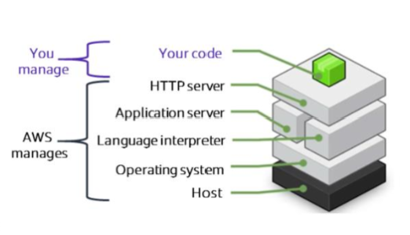

---
export_on_save:
  html: true
---
### Section 8: AWS Elastic Beanstalk

AWS Elastic Beanstalk is an easy-to-use service for deploying and scaling web applications and services developed with Java, .NET, PHP, Node.js, Python, Ruby, Go, and Docker on familiar servers such as Apache, Nginx, Passenger, and IIS.

Platform as a Service for setting up web applications

You're responsible for uploading your code and Elastic Beanstalk will handle the deployment on servers.

- Apache Tomcat (Java)
- Apache HTTP Server (PHP)
- NGINX or Apache HTTP Server (NodeJS)
- Passenger/Puma (Ruby)
- Microsoft Internet Information Services(IIS) for Java, C#, Java SE, Docket and Go

You have the option to take control over some of the elements of your infrastructure.

Elastic Beanstalk automatically scales your application based on your application's needs by using auto scaling settings - you can use CPU utilisation metrics to trigger automatic scaling actions.

There is no charge for Elastic Beanstalk, but only for the underlying AWS services like EC2 instances...

