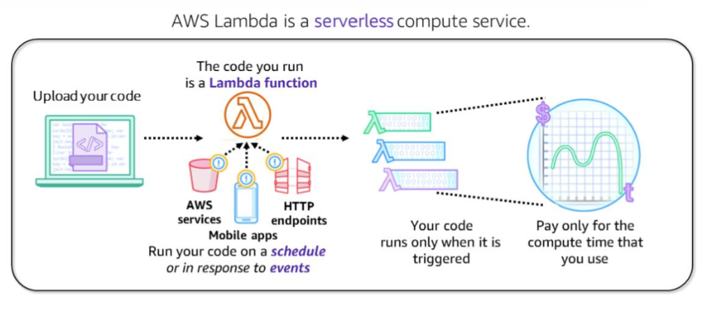
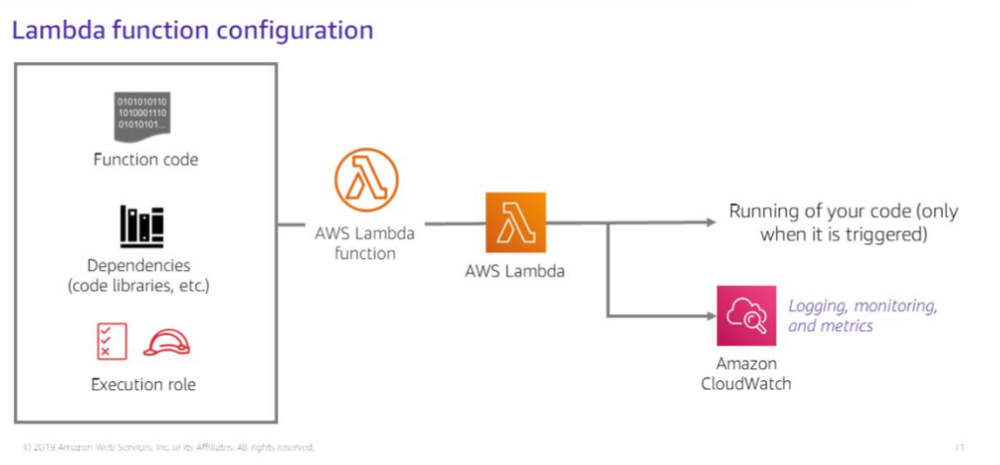
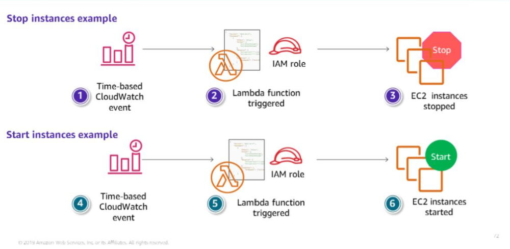
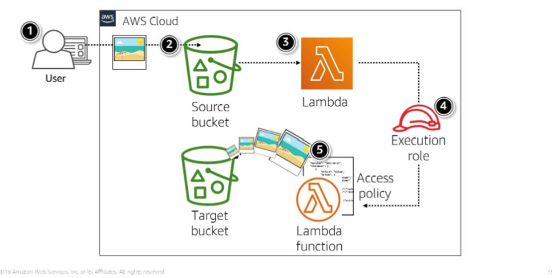

---
export_on_save:
  html: true
---
# Section 5: Introduction to AWS Lambda

AWS Lambda is an event-driven serverleess compute service.

Let's you deploy custom code without having to provision a server

You can configure your code to run in response to events or according to a preset schedule.

You only pay for the compute time consumed by your Lambda function. 

Your compute time is billed at the granularity of 1 millisecond.

### AWS Lambda event sources

An event source is an AWS service or an application that produces events which trigger an AWS Lambda function to run.

Some services invoke Lambda functions asynchronously
- S3
- SNS
- CloudWatch
  
Lambda can pull resources from Amazon Simple Queue Service (SQS) and read events from DynamoDB

Other services invoke Lamda functions directly like Elastic Load Balancers and API Gateways.

The Lambda console, API, SDK, and AWS CLI are some ways of invoking your Lambda functions.

### Lambda function configuration

- Function code
- Dependencies
- Execution role (IAM role that determines which AWS Services this lambda function can interact with)

- environment variables
- If you use the lambda API 

Example use cases:

1. Configure AWS Lambda function to automate the stopping and starting of your EC2 instances

2. Uploading thumnail images - run an AWS lambda function to create thumbnails when they are uploaded and store them in S3 buckets

### AWS Lambda limits

Soft limits per Region
- 1000 concurrent executions
- Max 75GB function and layer storage

Hard limits for individual functions
- Max function memory allocation = 10,240 MB
- Functions timeout in 15 minutes
- Max deployment package size is 250MB including layers
- Max Container image code package size of 10GB