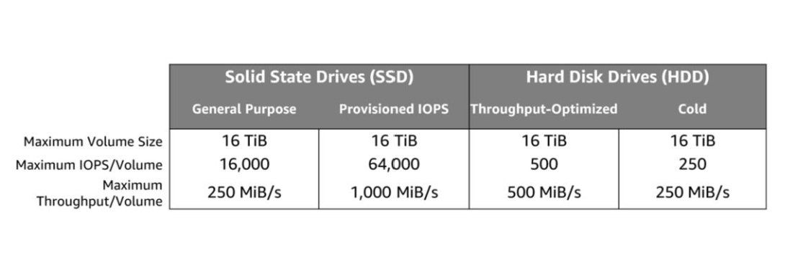
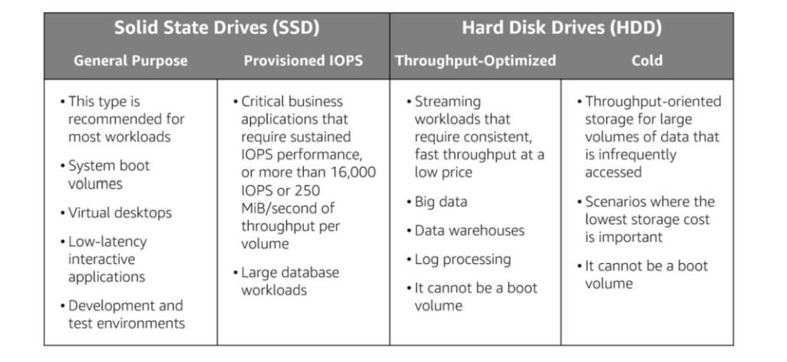

# Storage services

Preliminary concepts:

Non-volatile memory is memory that can retain data even when power is removed. E.g. SSD, HDD

Volatile memory is memory that requires power to retain data. E.g. RAM

### Section 1: AWS EBS (Elastic Block Store)

EBS is a form of unstructured, non-volatile block memory that can be attached to EC2 instances.

Due to it being non-volatile, EBS is a persistent storage service.

Each EBS can be attached to at most one EC2 instance at any point in time. Because EBS are physically attached to EC2s, they offer low latency data transfers to and from your EC2. Encryption of data in transit between an EBS and EC2 is provided for free.

EBS are automatically replicated with the same Availability Zone to provide data durability and high availability.

EBS volumes can be dynamically resized and you can change between SSD and HDD disk types

### Backup your EBS

We refer to EBS backups as snapshots.
- The initial snapshot is called the baseline snapshot.
- Subsequent snapshots capture differences between the current EBS and the latest snapshot.

Point-in-time snapshots enable you to recreate a new EBS volume from a snapshot at any time.

Snapshots can also be shared between AWS Regions. While there are no data ingress costs, there are data egress costs for moving data out of an EBS into a different AWS Region. Note that transfers within the same Region don't incur data egress costs.

Note: Only used storage blocks are copied to snapshots, so empty blocks do not occupy any snapshot storage space.
Note: When restoring a snapshot to a new volume, you can also modify the configuration, such as changing the volume type, size or Availability Zone.

### Block-level storage vs Object-level storage

Block storage allows you to update individual blocks whereas object storage forces you to update the entire object even if only a small part is changed.

Because only a part of the data needs to be updated in block storage compared to object storage, block storage tends to have faster transfer speeds and uses up less bandwidth. 

Block storage is, however, more expensive than object storage. 

### Types of EBS



AWS requires the boot volume of an EC2 to use an SSD 
  
### When to use which type of EBS?



### EBS pricing

In short, you pay for the amount of storage and the IOPS (volume of input/outputs per second).

With all EBS volumes, you pay for the amount of storage you provision in GB per month.

Depending on whether you provision a general purpose SSD, provisioned IOPS SSD or a HDD, your IOPS costs will vary.

- General Purpose SSDs
  - the input/output costs are included in the storage cost.

- Provisioned IOPS SSDs
  - the additional IOPS costs are complex. You are charged by the amount of IOPS you provision per month multiplied by the percentage of days that you provision for the month.

- HDDs or magnetic disks
  - you pay for the number of requests you make.


### Creating, attaching, mounting EBS volumes to EC2 instances

1. Create an EBS volume
2. Attach to EC2 instance
3. Connect to EC2 instance via SSH using PuTTY

Key bash commands
```bash
# df is short for Disk Free and displays free disk space. 
# The -h option denotes 'human-readable'
df -h 

# Create an ext3 file system on the new volume:
# sudo mkfs -t <file-system-type> <path/to/newvolume>
# 'mkfs' is short for Make File System
# '-t' lets you specify the file system type
sudo mkfs -t ext3 /dev/sdf

# Create a suitably named directory for mounting the EBS volume
# sudo mkdir <path/to/directory_name>
sudo mkdir /mnt/data-store

# Mount a volume
# sudo mount <path/to/storage/volume> <path/to/created/directory>
sudo mount /dev/sdg /mnt/data-store

# configure the Linux instance to mount this volume whenever the instance is started
# add a line to /etc/fstab.
echo "/dev/sdf   /mnt/data-store ext3 defaults,noatime 1 2" | sudo tee -a /etc/fstab
```