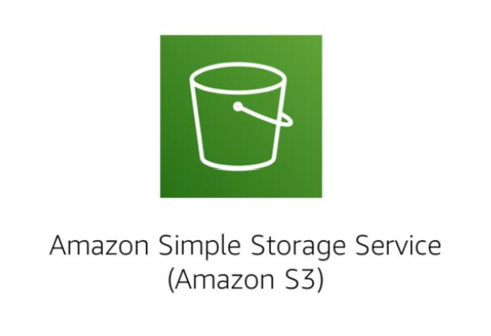

---
export_on_save:
  html: true
---
# Section 2: AWS S3 (Simple Storage Service)

A durable object-level storage service that stores data as objects in buckets

Each object is limited to around 5TB which provides you with practically unlimited storage

Buckets are logical containers that can store almost all data types including images, videos and server logs.

Buckets are be accessed through HTTP(S) similar to how you would access REST endpoints or through VPC endpoints.

AWS S3 manages scales your bucket storage and requests for you

### Data durability and security

By default, buckets are replicated across at least 3 accessibility zones.

You can configure security options for individual buckets.

Supports both server-side and client-side encryption of data at rest for data uploads.

By default, public access to newly created buckets is denied.

### Integration with AWS Lambda functions

You can set up event notifications to trigger events when an object is uploaded to or deleted from a bucket and trigger Lambda functions.

### S3 storage classes

There are a range of different object-level storage classes:

- Amazon S3 Standard	
  - standard durable, performant and highly available object-level stoage
- Amazon S3 Intelligent-Tiering
  - designed to optimise costs by analysing your data access and moving infrequently accessed data into the infrequent access tier if unaccessed for 30 consecutive days.
  - has two storage layers: frequently accessed; infrequently accessed
- Amazon S3 Standard-Infrequent Access (Amazon S3 Standard-IA)
  - stores infrequently accessed data that can be retrieved with low latency 
- Amazon S3 One Zone-Infrequent Access (Amazon S3 One zone-IA)
  - Same as the Standard Infrequent Access class but doesn't replicate data across availability zones
- Amazon S3 Glacier 
  - stores data unlikely to be accessed with slow retrieval times.
- Amazon S3 Glacier Deep Archive
  - cheapest storage class that stores data accessed a couple of times a year
  - 12 hours retrieval time
  - long-term data retention (7 to 10 years)

### S3 bucket URLs

There are two URL formats for S3 buckets

1. Bucket path-style URL endpoint

`https://s3.<region_name>.amazonaws.com/<bucket_name>`

2. Bucket virtual hosted-style URL endpoint

`https://<bucket_name>.s3<region_name>.amazonaws.com`

Bucket names must be globally unique and DNS compliant. This is because they form part of the URL address through which the bucket is accessed and URLs must be globally unique.

Uploaded files are referred to as objects because they get wrapped with metadata (which includes the object's url) and are stored as objects in S3 buckets.

Folders are logical separators for organising files/objects in your S3 bucket.

You can configure the permissions for each uploaded file.

### S3 bucket configurations

[S3 Transfer Acceleration](https://aws.amazon.com/s3/transfer-acceleration/)

Amazon S3 Transfer Acceleration creates fast, easy, and secure transfers of files over long distances between your client and your Amazon S3 bucket. S3 Transfer Acceleration leverages Amazon CloudFront’s globally distributed AWS Edge Locations. As data arrives at an AWS Edge Location, data is routed to your Amazon S3 bucket over an optimized network path.

### Pricing

You pay for:
- GBs per month
- Outbound data transfers to other Regions
- PUT, COPY, POST, LIST, GET requests

This would mean that data transfers out of S3 to EC2 instances in the same region would incur no costs.

- Storage class type
- Amount of storage - number and size of your buckets
- Number and type of HTTP requests
- Data egress fees for cross regional data transfers