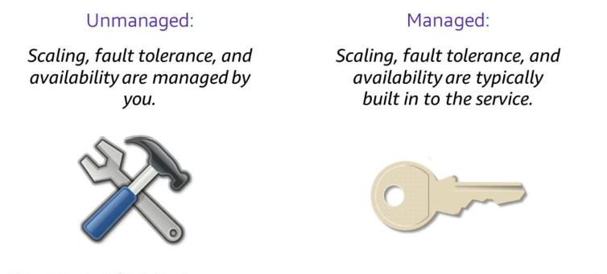
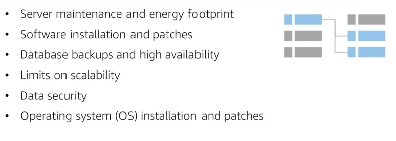
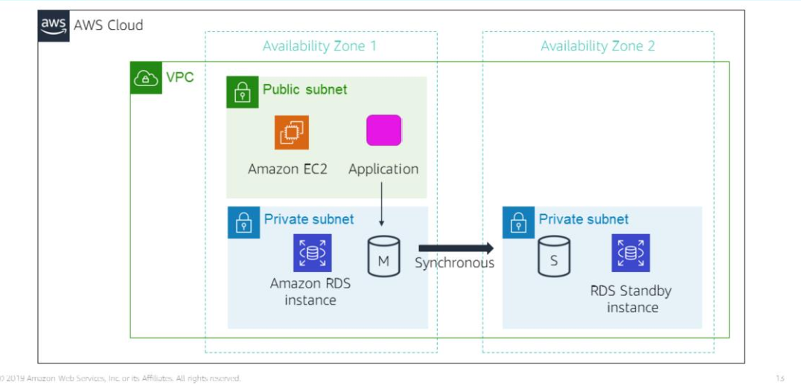
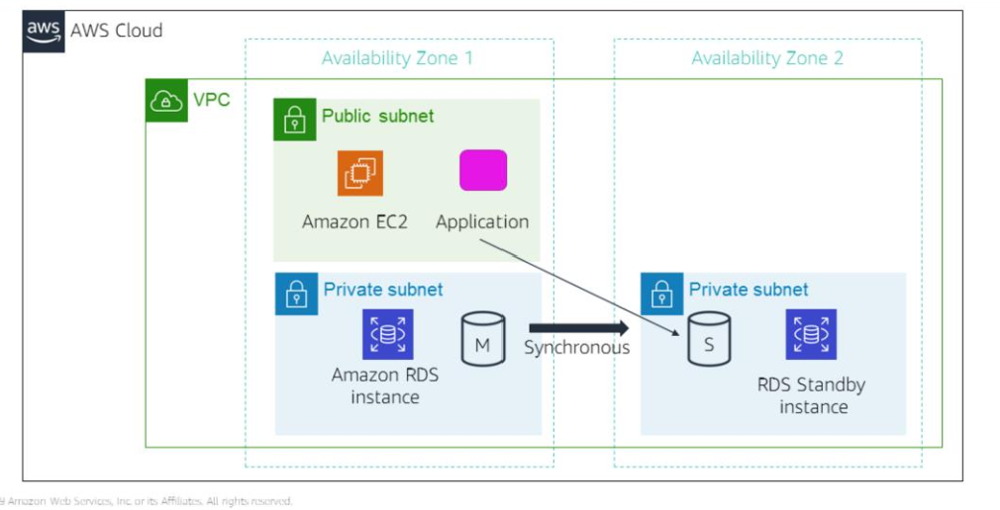

# Section 1: Amazon Relational Database Service

Managed vs Unmanaged services

Unmanaged services require the user to do the provisioning and manage how their solution handles load changes, errors and when resources are unavailable. But, in return, this gives the user more fine-grained control over their cloud solutions.

For instance, with an EC2 instance, the user must manage how their EC2 instance should scale to handle increased traffic loads by specifying a scaling solution like AWS Automatic Scaling. 

Managed services require the user to configure them and set permissions. With AWS S3, the user just needs to configure permissions and set up an S3 bucket; AWS S3 will handle scaling, fault-tolerance and availability automatically.

### Amazon Relational Database (RDS)

Amazon RDS is a managed relational database service in the cloud.

These tasks associated with running your own relational database are addressed by Amazon RDS.

### Onpremises vs EC2 vs RDS

Running your relational database on EC2
- You are still responsible for patching the OS and handling software and backup operations. AWS RDS handles the rest of the administrative tasks.

RDS or Amazon Aurora (these are platforms as a service)
- application optimisation

Database instance - an isolated database environment that can contain multiple user-created databases

Database Instance Class
- CPU
- Memory
- Network performance

Database Instance Storage
- Magnetic (HDD)
- General Purpose (SSD)
- Provisioned IOPS

Pricing depends on the selected instance class and storage.

Supported relational database engines:
- MySQL
- PostgreSQL
- Amazon Aurora
- Microsoft SQL Server
- MariaDB
- Oracle

You can run database instance in a VPC, usually in a private subnet.

What does it mean to seed a database copy?

### High availability with Multi-AZ (multi-AvailabilityZone) deployment

With AWS RDS, you have the ability to configure your database instance for high availability with Multi-AZ deployment. 

RDS automatically generates a standby copy of your database instance in another Availability Zone within the same VPC. 

Database transactions are synchronously replicated to the standby copy, thereby minimising chances of data loss.

This means that if the main database instance fails, Amazon RDS will automatically bring in the standby database instance as the new main instance. This is made possible by referencing the database instance by name using the RDS DNS (Domain Name System) endpoint in your applications.

### RDS read replicas

RDS also lets you created read replicas for MySQL, MariaDB, PostgresSWL and Amazon Aurora database instances.

Updates to the source database instance are asynchronously copied to the replica instance.

For scaling purposes, you can redirect read-heavy database queries to your read-only replica instance, thereby reducing the load on your primary instance.

It is also possible to convert your replica instance into the primary instance.

Read-only replica instances can also be created in a different Region to your primary database instance. 

### Example use cases

- Web and mobile app 
  - high throughput
  - storage scaling
  - high availability
- E-commerce apps
  - low-cost database
  - data security
  - fully managed solution
- Mobile and online games
  - auto scaling
  - database monitoring
  

Ideal conditions for using Amazon RDS
- Complex transaction or complex queries
- Medium/High read or write rates - up to 30,000 IOPS (15,000 reads and 15,000 writes a second)
- No more than a single worker node/shard
- High durability

When not to use RDS
- Massive read/write rates
- Sharding for large data volumes or throughput demands
- Simple GET/PUT requests and queries
 
Alternative solutions:
- Running your relational database engine on an EC2 instance
- NoSQL solution like DynamoDB

### How RDS are billed

Clock-hour billing - you pay for the time your resources are running. This includes the resources expended from the time you launch a database instance until you terminate that database instance.

Your database engine, size and memory class will also affect the pricing.

### Purchase type and multiple RDS instances

Purchase types:
1. On-Demand Instances - compute capacity by the hour
2. Reserved Instances - Single upfront payment for 1yr or 3yr terms

You can also provision multiple database instances for horizontal scaling.

### RDS Storage

Provisioned storage 
  - Active database instances = No additional charge for backing up 100% of your provisioned database storage
  - Terminated DB instances - backup storage is charged for each GB/month.
  
Additional storage
  - Both provisioned storage and backup storage are charged for each GB/month

### RDS Deployment types and Data transfer

Deployment types
- single availability zone
- multiple availability zone

These affect your storage and I/O charges

Data transfer
  - inbound data transfer is free
  - outbound data transfer is based on a tiered system

DB subnet groups tell Amazon RDS which subnets can be used for RDS database instances.

