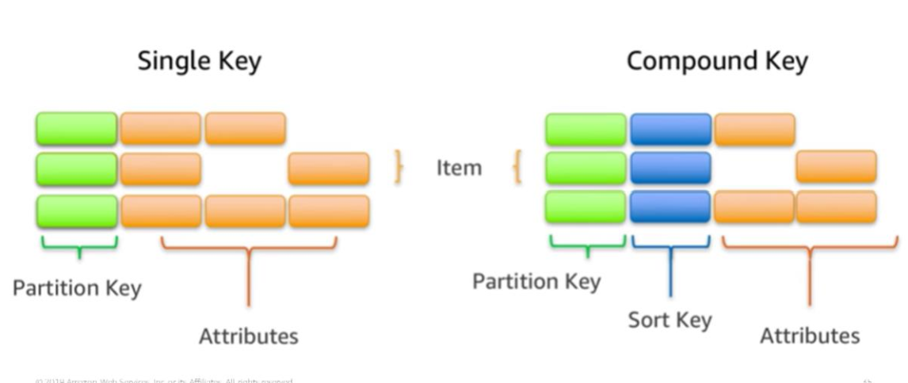
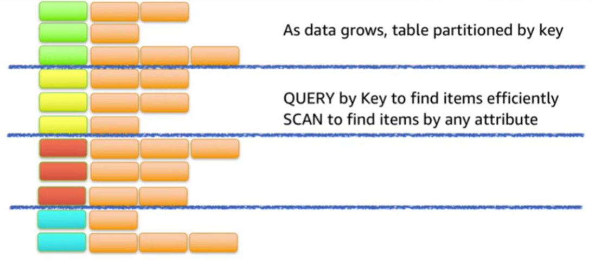

---
export_on_save:
  html: true
---
# Section 2: Amazon DynamoDB

Managed serverless NoSQL database optimised for low-latency performance

- The database is replicated across multiple availability zones within a Region
- Table storage is optimised for large and volatile data sets.
- Its query language is optimised for low-latency performance.
- Data is stored in SSDs
- Option to encrypt data at rest

### Tables, items and attributes

Attributes are the most fundamental data elements
Items are uniquely identifiable groups of attributes
A table is a collection of items.

Two primary key types:
1. A single key composed of a single attribute: partition key
2. A compound key composed of two attributes: partition key and sort key

Each item in a table must have a key.

### Querying your database

1. Query by key attributes

This way of finding data is efficient because your items are indexed by their primary keys

2. Scan for match conditions on non-key attributes

While less efficient than the first method, this method provides greater flexibility

### Read consistency

[Further reading](https://docs.aws.amazon.com/amazondynamodb/latest/developerguide/HowItWorks.ReadConsistency.html)

Due to how DynamoDB databases are replicated across multiple availability zones, when you write data to a table in DynamoDB, it takes time for the update to be synchronised across all your replicates. Data is eventually consistent across all of your storage locations usually within a second. 

Both eventually consistent and strongly consistent reads are supported by DynamoDB.
The default read consistency is eventually consistent.

Eventually consistent reads
- read queries might not return the latest data

Strongly consistent reads
- read queries return latest data
- uses more throughput
- higher latency

