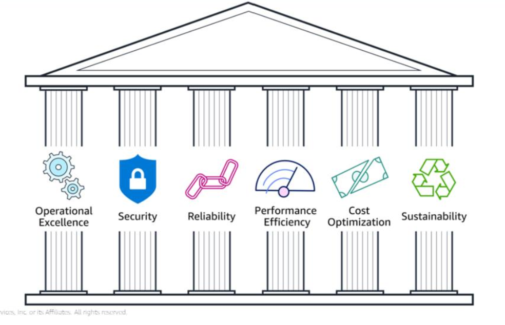
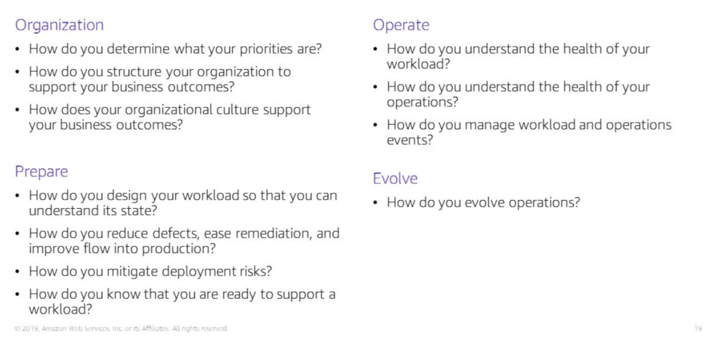
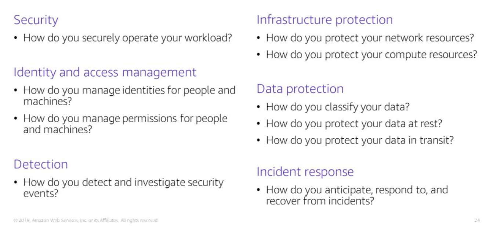
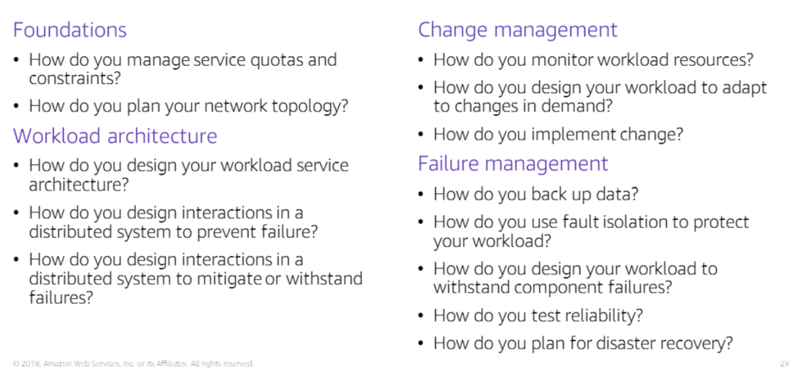
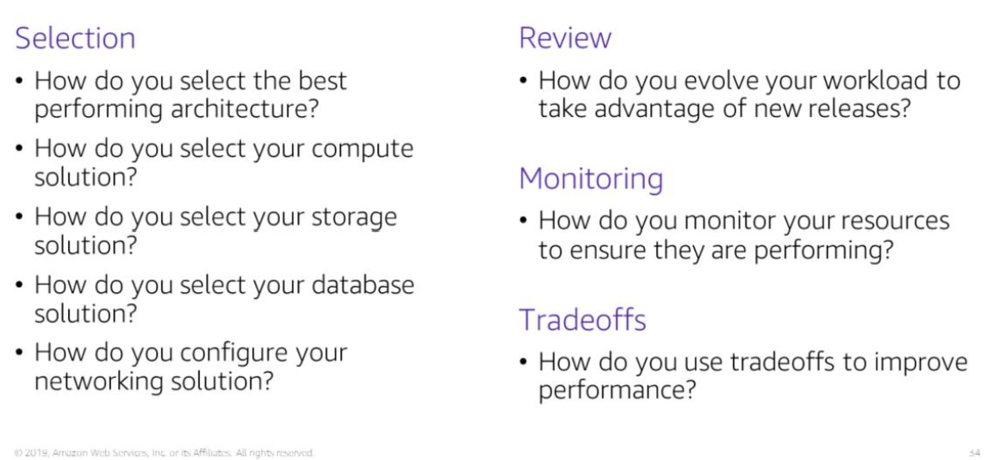
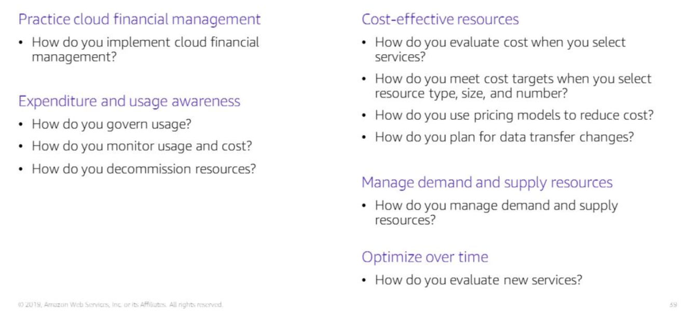

# Section 1: Cloud architecture

Architecture - designing and building large structures

Cloud architects
- identify business goals
- ensure that technological solutions align with business goals
- work with delivery team (engineers, data scientists etc.) to ensure that the technological solution has the appropriate features

### AWS Well-Architected Framework

A guide for designing cloud infrastructures that are 
1. Secure
2. Performant
3. Resilient
4. Efficient

Consistent approach to evaluating and implementing cloud architecture.

It provides a set of foundational questions and best practices that can help you evaluate and implement your cloud architectures.

### Pillars of the well-architected framework

### Operational excellence
 
Focus - run and monitor systems to deliver business value and to continually improve processes

Key topics
- Managing, automating changes
- Responding to events
- Defining standards for managing daily operations successfully

### Six design principles

1. Peform operations as code (limit human error and allow for consistency)
2. Annotate documentation
3. Frequent, small reversible changes
4. Refine operations frequently
5. Anticipate failure (set up regular test workloads to validate your team responses)
6. Learn from all operational events and failures (sharing learning across organisation)

### Questions to consider for operational excellence:

Three overarching themes
Prepare
Operate
Evolve

### Security

Focus - protect information, systems, and assets wihle delivering business value through risk assessments and mitigation strategies

Key topics
- Protecting the confidentiality and integrity of data
- Identifying and managing access permissions
- Protecting systems
- Putting in place controls to detect security events

### Security design principles

1. Implement a strong identity foundation (give users the minimum amount of access needed to complete their tasks)
2. Enable traceability (monitor, alert and audit actions and changes to your cloud environment in real time)
3. Apply security at all layers of your architecture (VPC, subnets, instances, edge networks, load balancer, application)
4. Automate security best practices
5. Protect data in transit and at rest
6. Keep people away from data (reduces risk of human error)
7. Prepare for security events (setup an incident management process; run incident response simulations)

### Questions to consider for architecting a secure cloud infrastructure

### Reliability

Focus - ability to recover from system infrastructure failures

Key topics
- setup
- cross-project requirements
- recovery planning
- handling change

### Design principles

- Test recovery procedures
- Automatically recover from failure (put in place triggers for automated recovery when a manually configured threshold is reached)
- horizontal scaling (replace a large resource with many smaller resources and distribute loads across the smaller resources to build fault-tolerance into your systems)
- Monitor demand and system usage to automate the provisioning of resources to maintain optimal levels for meeting demands
- Manage change in automation (use automation to manage changes to infrastructure)

### Questions to consider

### Performance and Efficiency

Focus - Use IT and computing resources to meet system requirements efficiently

Key topics 
- Selecting the right resource types and sizes abasd on workload requirements
- Monitoring performance
- Making informed decisions to maintain efficiency as business needs evolve

Performance efficiency design principles
- Democratise advanced technologies (less time spent on provisioning and setting up infrastructure on machine learning, NoSQL databases and big data environments, more time on product development)
- Go global in minutes (Deploy apps in multiple AWS Regions)
- Use serverless architectures (removes burden on managing and running a server)
- Experiment with different configurations
- Mechanical sympathy (when selecting a database or storage solution, you can stick to HDDs if you don't really need the benefits that SSDs provide over HDDs)

### Questions to consider 

### Cost optimisation

Focus - Avoid unnecessary costs

Key topics
- Understand and control where money is spent
- Select the most optimal type and number of resources
- Analyse diachronic spending data
- Scale to meet business needs without overspending

Cost optimisation design principles
- Implement Cloud Financial Management
- Measure overall efficiency (measure the business output of the workload and the costs of delivering the workload to see how the input costs are affecting the business outputs)
- Stop spending money on undifferentitated heavy lifting (spend less on IT infrastructure; more on business applications)
- Analyse and attribute expenditure (makes it easy to accurately pinpoint system usage and costs and to come up with practical responses)

### Questions to consider

