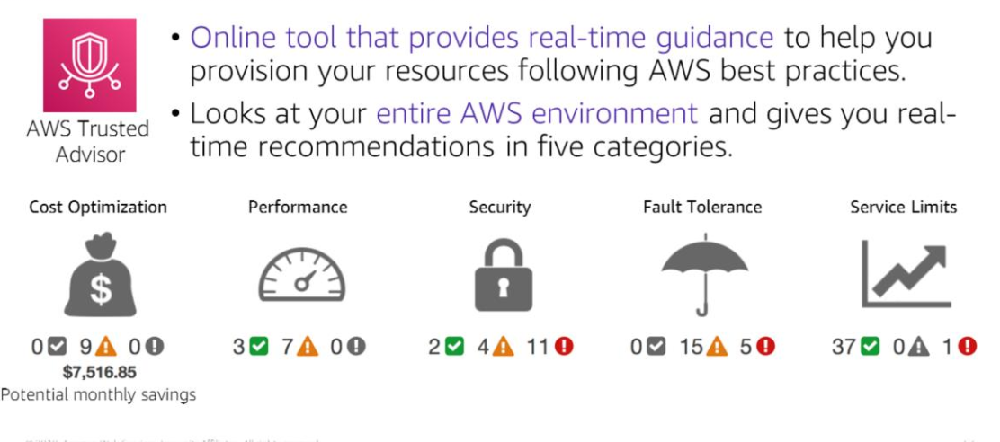

# Section 3: AWS Trusted Advisor

Trusted Advisor is an online tool that provides real-time guidance to help you provision your resources in accordance with AWS best practices.

Gives you real-time recommendations in five categories after looking at your entire AWS cloud environment

- Cost optimisation
  - helps you optimise cost by giving recommendations on eliminating unused and idle resources or by making commitments to reserved capacity.
- Performance
  - checks service limits
  - monitors for overutilised instances
- Security
  - examines your permissions
  - enables AWS security features
- Fault tolerance
  - auto scaling
  - health checks
  - multi-availability zone deployments
  - back-up capabilities
- Sevice limits
  - checks that service usage is at least 80% of the service limit
  - 

Example warning types

MFA on Root Account
- alerts user if MFA is not enabled on Root Account

IAM Password Policy
- alerts user if a password policy is enabled with no password content requirements
- Creating/changing a password policy is enforced immediately for new users but doesn't require existing users to change their passwords

Security Groups - Unrestricted Access
- alerts user if a security group rule has a source IP address with a /0 suffix for ports other than 25, 80 or 443.

Amazon EBS Snapshots
- yellow alert if the most recent volume snapshot is between 7 and 30 days old
- red alert if the volume has no snapshot or if the most recent volume snapshot is more than 30 days old
- volume snapshots are stored in S3 for durable storage and point-in-time recovery

Amazon S3 Bucket Logging
- yellow alert if an S3 bucket doesn't have server access logging enabled
- yellow alert if the owner account doesn't have permission to access an S3 bucket since the Trusted Advisor can only check buckets that the owner account has permissions to.
- server access logging involves delivering hourly access logs to a bucket you choose and is not enabled by default

