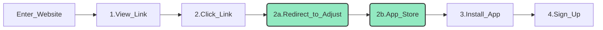
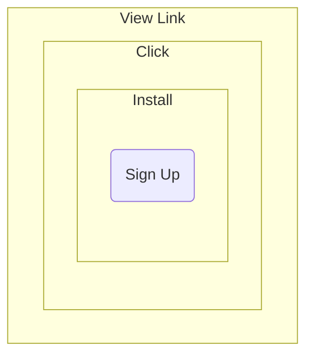
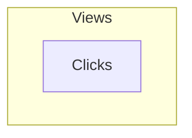
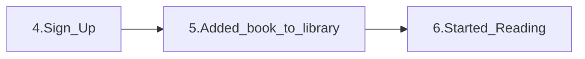
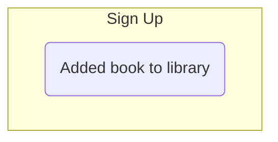
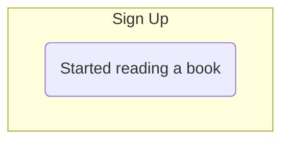

---
export_on_save:
  html: true
---
# Marketing funnels

#### Mobile analytics marketing funnel

**Steps**
1. View link
2. Click clink
3. Install app
4. Sign up

#### Flowchart diagram of funnel steps

Between Steps 2 and 3 the user is redirected to the adjust link which then takes the user to the app/play store.

#### Marketing funnels in terms of venn diagrams

		

Click Through Rate (CTR)

#### Left joins
#### Example funnel - VueJS

#### Activation rates

Soft activation rate

Activation rate

Ch.148
Calculate the percentage of users who started reading a book 1 hour after landing on a library page.

