---
html:
  embed_local_images: true
  embed_svg: true
  offline: false
  toc: true

print_background: false
---
# Talend Data Integration Advanced 

### Using Git in Talend Studio
- [ ] Pull a project from a remote Git repository
- [ ] Commit Jobs and push them to a remote Git repository
- [ ] Work on a local Git repository
- [ ] Resolve merge conflicts in Talend Studio
- [ ] View the Git history of a project

Git works mostly as you would expect, but each time you make a save, a commit is made automatically.

### Remote execution of Jobs using Talend JobServers

- [ ] Configure Talend Studio to identify remote JobServers
- [ ] Run a Job from Talend Studio on a remote JobServer

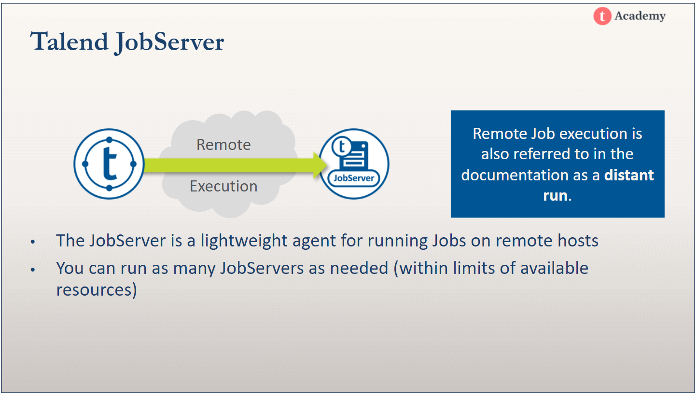
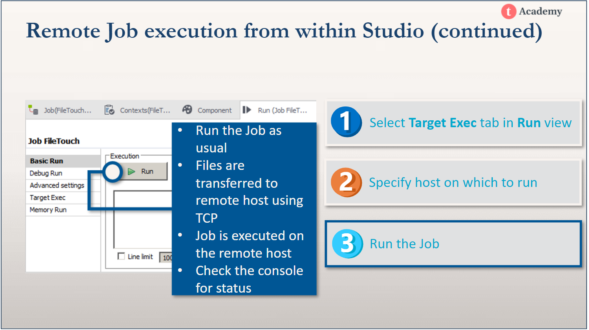
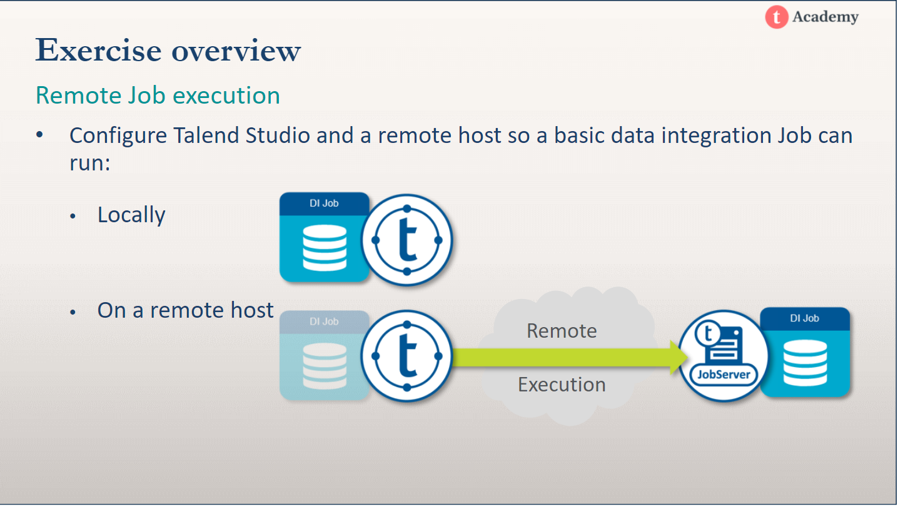

### Trace Debug

- [ ] Use debugging tools that do not require deep Java development skills (Trace Debug)

Trace Debug let's you go through a job row by row and see how individual components transform and process data.

When stepping through rows after pausing on a breakpoint using Trace Debug, you are limited to going back 4 steps.

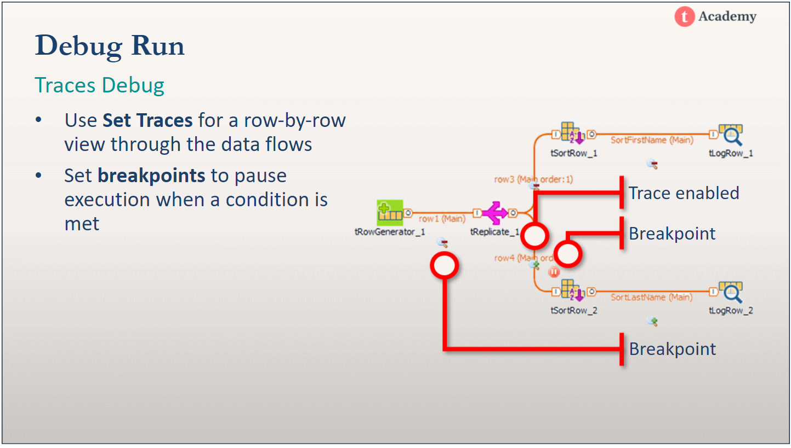
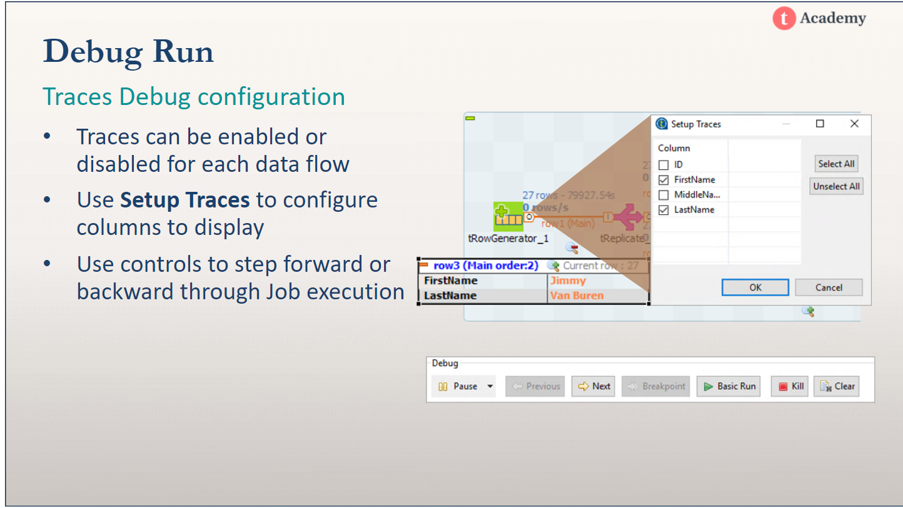


### Parallelisation

- [ ] Configure a Job to use multi-threaded execution
- [ ] Configure an individual component to use parallel execution
- [ ] Use a Talend component to run subJobs in parallel
- [ ] Use Talend components to split your data across multiple threads for multi-threaded execution

Synchronous/Sequential execution
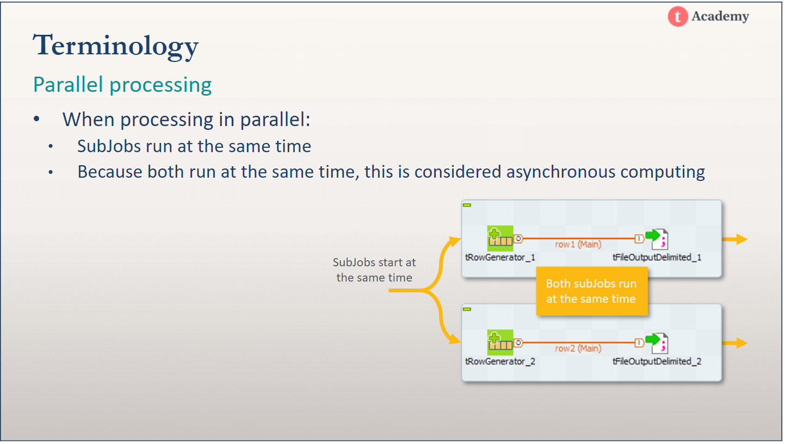

Asynchronous/Parellel execution
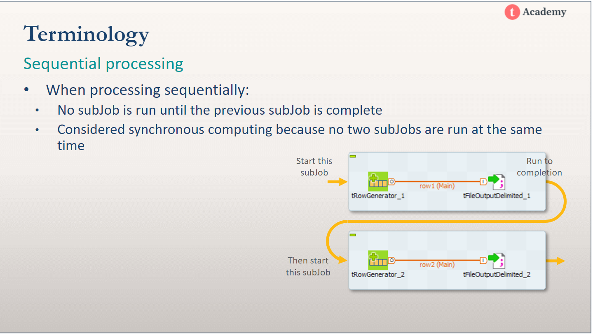

Multithreading is one way of achieving parallelisation. Talend has the option to enable multithreading for all unconnected subjobs.

The tParallelise component lets you have greater control over which subjobs to run in parallel.

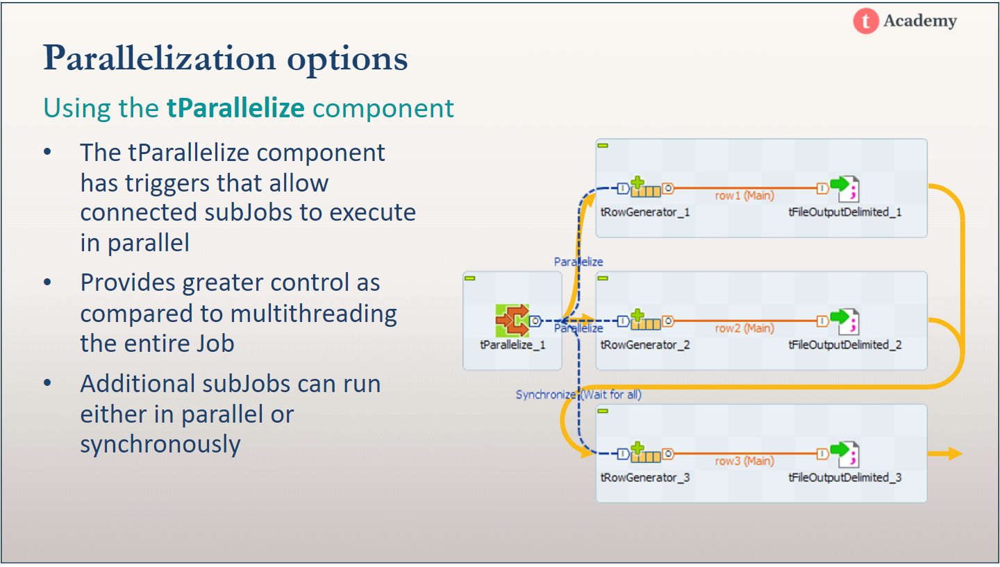

Many components also have the option of enabling parallel execution.

Enabling 'multi-thread execution' on a job will decrease performance if the CPU has only a single core


nb. "Dynamic" is an opaque data type that allows data to be passed through without the columns in the file or database being known. It captures all columns not explicitly named.


The tDepartitioner component regroups the outputs of the processed parallel threads, and the tRecollector component captures the output of a tDepartitioner component and sends data to the next component.

Never use a thread count that is higher than the number of available processors. This can lead to degradation in performance and loss of the advantage of multithreading.


### Memorizing Data

- [ ] Define an autojoin use case
- [ ] Design a Job using the memorization logic
- [ ] Configure the tMemorizeRows component

Self-joins using the tMap component involve calculating Cartesian products which are costly operations in Talend

A more performant method is to prepare your data (usually by sorting and grouping it so that rows are ordered appropriately for processing) then memorize several rows of data with the tMemorizeRows component. This component makes it easy to access several previous rows of data along with the current one. It then allows you to compare with and refer to previous rows of the same source of data.

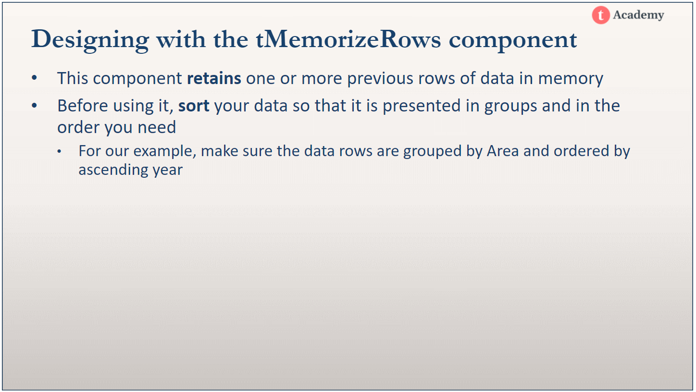
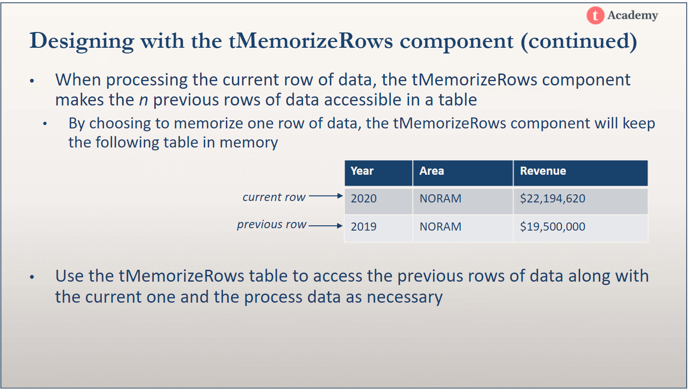

tMemorizeRows component

```java
Product_ID_tMemorizeRows_1[0].equals(Product_ID_tMemorizeRows_1[1]) ? 
    Price_tMemorizeRows_1[1] : null
```

One-line ternary expression. As you can see, the memorized rows are stored in tables. There is one table per memorized column. The table name is defined as `variable_name_component_name`. Here, the `Product_ID` column is memorized by the `tMemorizeRows_1 component` in the table named `Product_ID_tMemorizeRows_1`. The 0th element of the table contains the current row value; the 1st element contains the previous row value.

Here, the ternary operator evaluates whether the previous row of data concerns the same product as the current row. If this is the case, then the current row and the memorized row are two history lines concerning the same product, so the returned value is the price of the previous row of data. Else, if the `Product_ID` values are different, then the two rows of data are not related, and the returned value is null.

### Joblets

- [ ] Create a Joblet from scratch
- [ ] Create a Joblet from an existing Job
- [ ] Create a Joblet that allows triggered executions
- [ ] Use a Joblet in a Job

You can breakdown a single Job into modular and reusable groups of components called Joblets that can themselves be treated as components.

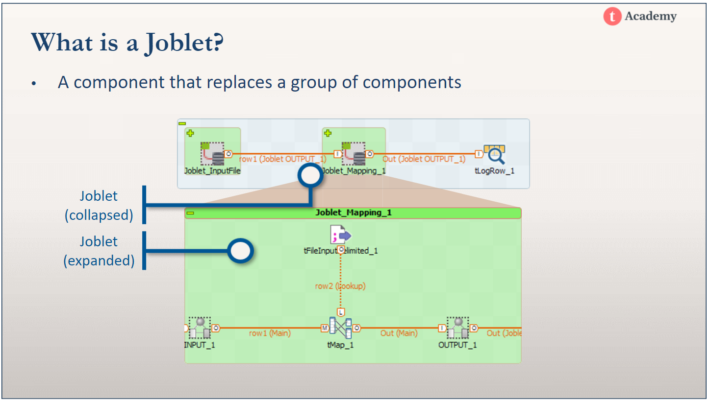
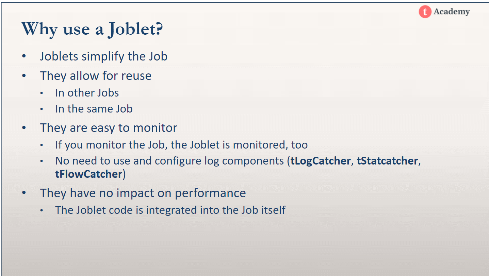

A Joblet is a specific type of component that replaces Job component groups. It factorizes recurrent processing or complex transformation steps to make a complex Job easier to read. Joblets can be used in different Jobs or used several times in the same Job.

Available Joblets appear in the Repository in the Joblet Designs section.

Unlike with the tRunJob component, Joblet code is integrated in the Job code. This way, the Joblet does not impact the performance of the Job. In fact, Joblet performance is exactly the same as in the original Job, while using fewer overall resources.

Joblets share context variables with the Job to which they belong.

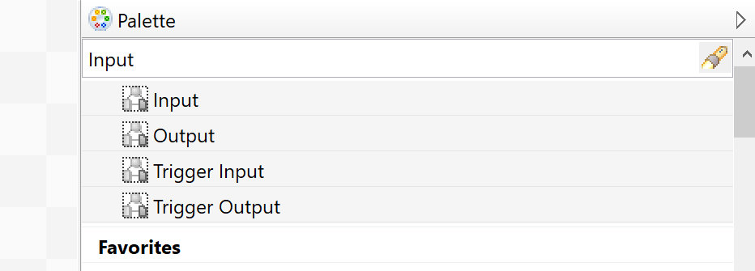

Joblets vs tRunJob components
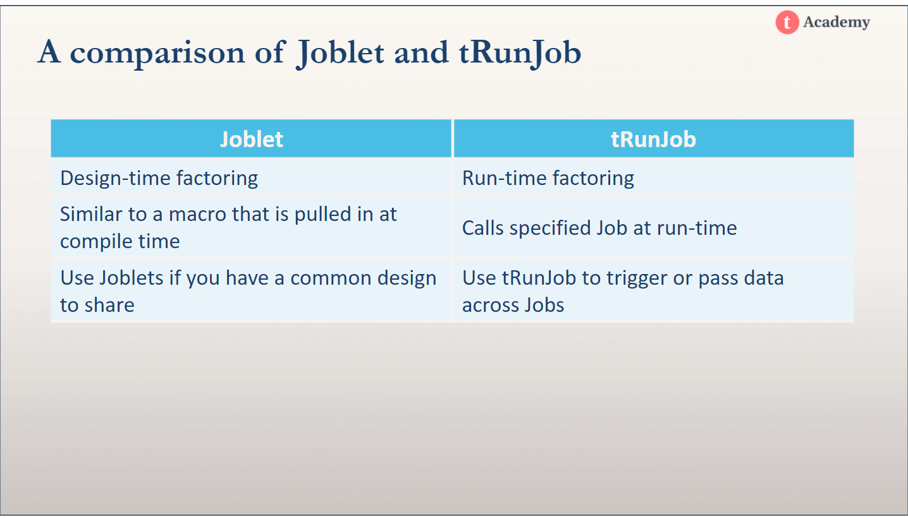


### Custom Java Code

- [ ] Differentiate between the Java components on the palette
- [ ] Execute simple Java instructions using the tJava component
- [ ] Alter rows of data using the tJavaRow and tJavaFlex components
- [ ] Create Java routines and call them in Talend components

Writing Java code in editable component fields

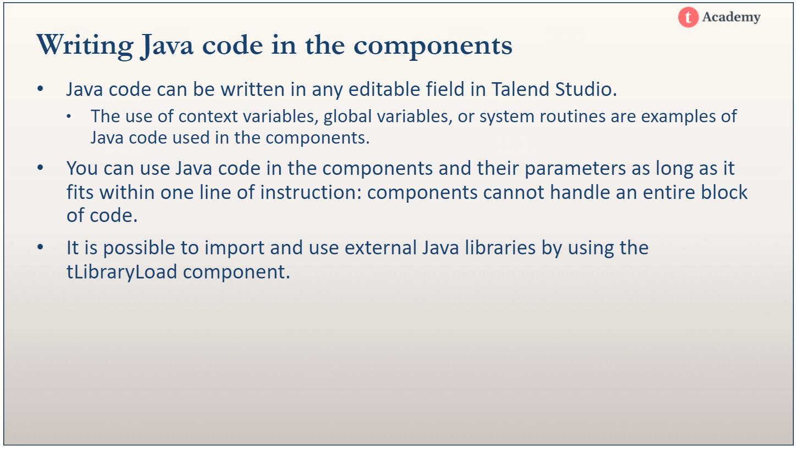

tJava
- Executes one or more lines of Java code
- The code only executes once; it does not run on each row of data, but one time for the entire flow
- The component cannot access the rows of data in either read or write mode, so it is not suited for any data-processing code
- The component can access global and context variables

cf. the tMap component executes all expressions each time it processes a row of the data flow.

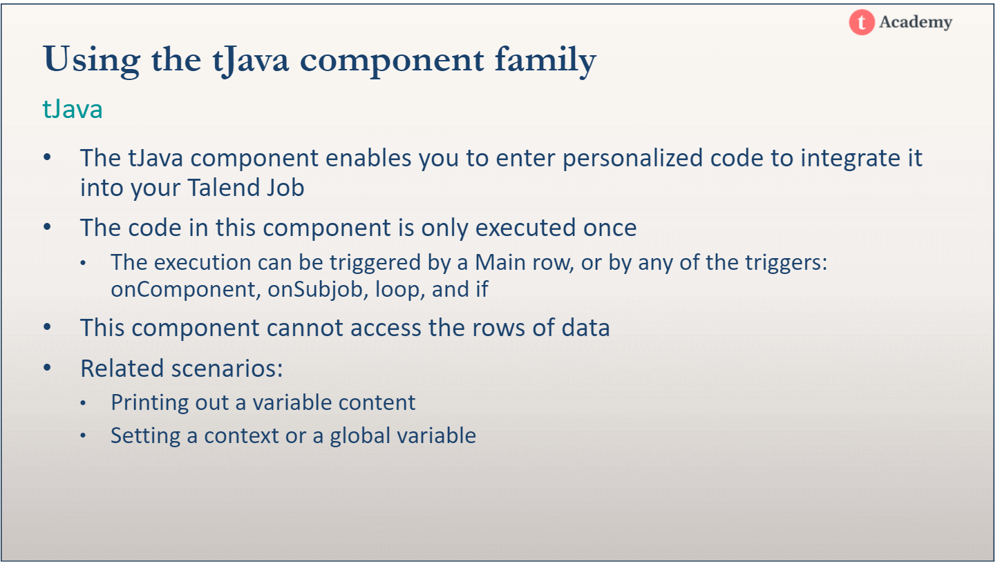

tJavaRow
- custom Java code for processing data rows
- has access to data rows

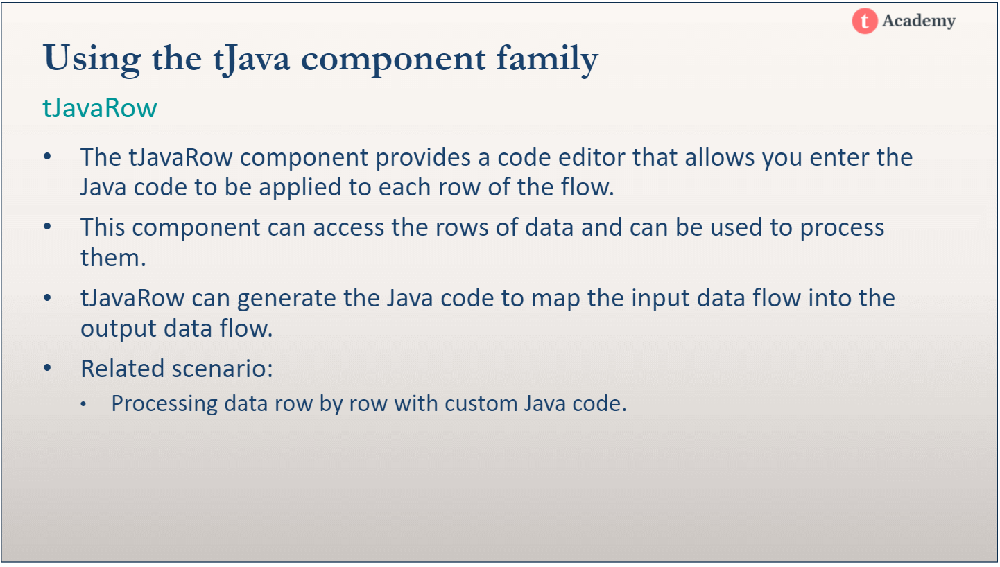

tJavaFlex
- more complex Java code structured into 3 sections: start, main and end
- When the 'Data Auto Propogate' is checked, the component will automatically propagate all data from the input row to the corresponding output row. No action is needed in the Java code.
- 
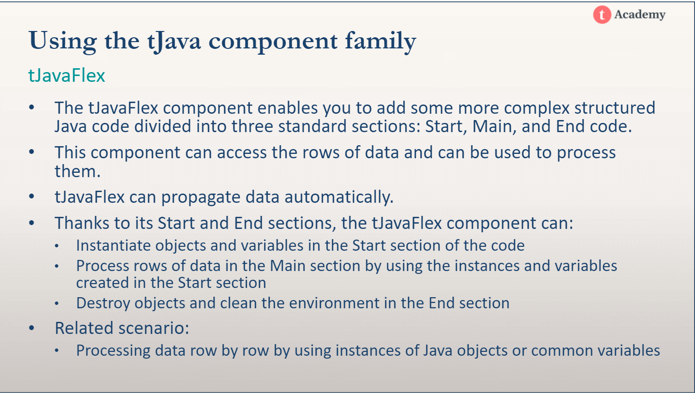

```java
// Java code for generating user IDs starting from 1
String.format("%10s", Numeric.sequence("s1",1,1)+"").replace(' ', '0');
```

tJavaRow vs tJavaFlex

- tJavaRow has one unique block of code and does not propagate data automatically - if an output row does not receive any explicit instruction in the code, it comes out as empty or even null, which may trigger errors.
- tJavaFlex has three blocks of code (Start code, Main code, and End code) and propagates data automatically
- Both JavaRow and JavaFlex require you to manually configure the output schema

nb. To access a column in a row, type `name_of_the_row.name_of_the_column`. Here 'row' refers to the data connection between components. If we have a job that looks like this:

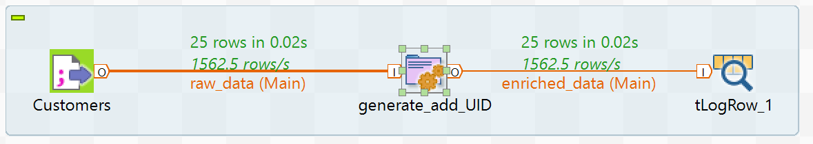

Then we can write `raw_data.Country` to access the Country column of the raw_data row. Similarly, we can write `enriched_data.Firstname` to access the Firstname column of the output data row.

Java routines

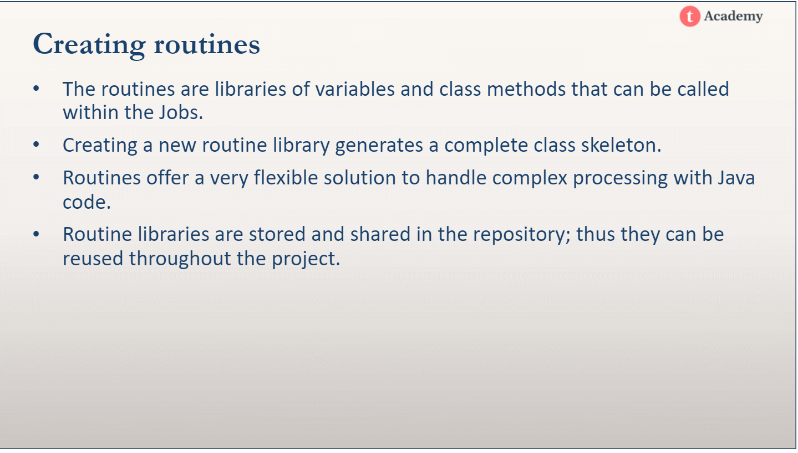

Creating a routine creates a blank Java class file which you can then configure.


### Change Data Capture (CDC)

- [ ] Configure a database table to be monitored for changes in a separate Change Data Capture (CDC) database
- [ ] Create a Job that uses the information in a CDC database to update a master database table with just the changes from the monitored database table

Use CDC to update databases/data warehouses by only updating data that has changed (insertions, deletions, updates). By not having to process unchanged data, we are able to save time and money through reducing the time, compute resources, network bandwidth and memory required to keep data warehouses updated and in-sync with production databases.

cf. CDC with loading and updating entire databases

CDC is usually implemented by creating a CDC database that tracks changes to production databases and we can then use incremental ETLs based on transactions in our CDC database to synchronise or update data warehouses.

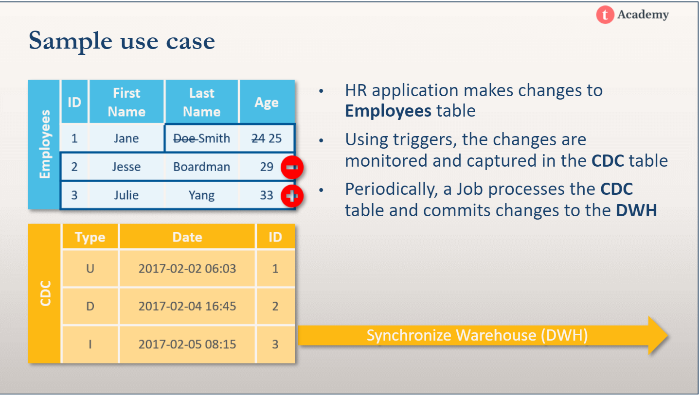

CDC Architecture

Step 1 - production database tables are updated - this sets off a trigger which logs the change to the CDC database table
Step 2 - look up the CDC database table to see what data we need from the production database tables to update our target database.
Step 3 - our Talend Job applies the changes to our target table in our target database; the CDC table is also emptied.

> Step 1
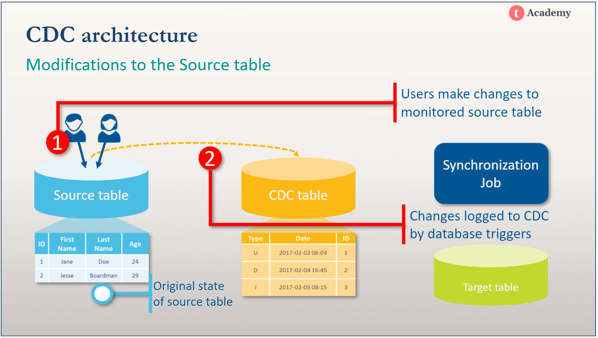

> Step 2
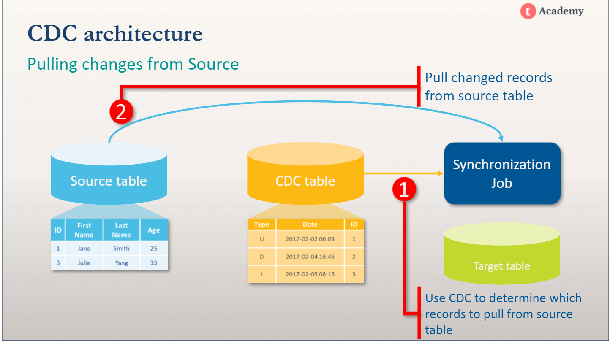

> Step 3
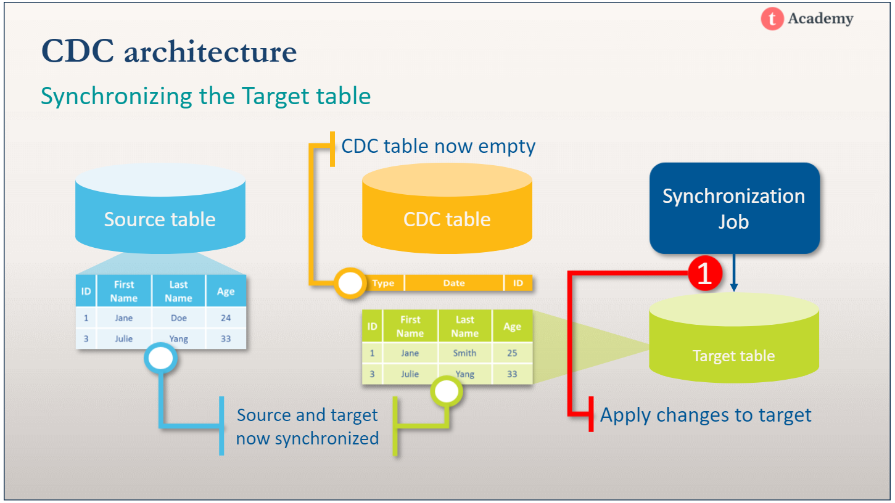


Example CDC Job

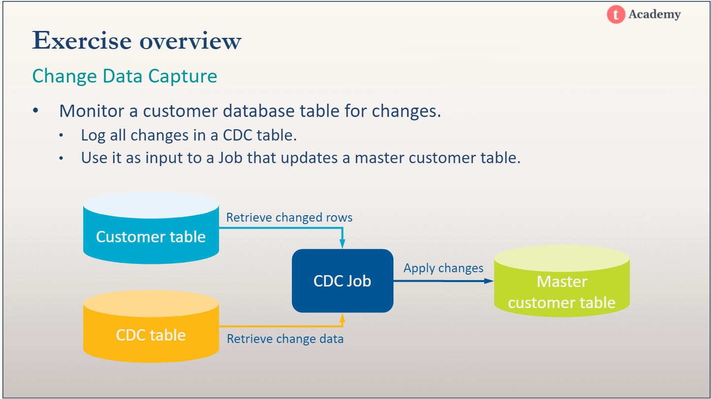

Many situations require that you keep two or more databases synchronized with each other. For example, you may have a centralized data warehouse that you need to keep current with one or more subsidiary databases. Given that databases are frequently massive, reloading the entire subsidiary database into the warehouse is often impractical. A more realistic solution is to monitor the subsidiary database for changes, then duplicate those changes in the master or warehouse database.

In this lesson, you configure a change data capture (CDC) database that monitors a separate database containing customer data for changes—record updates, deletions, and insertions.

The CDC database stores a list of indexes of records that have changed, the types of changes, and timestamps for them, but not the changes themselves. You then create a Job that uses that list to update the master database with just the modified records from the subsidiary database:

tDBCDC

The tDBCDC component extracts changed data from the subscribed table (monitored by CDC process) and makes it available for processing. 

Comments: The tDBCDC component pulls change events to be processed and applied from a CDC table to a target database table.

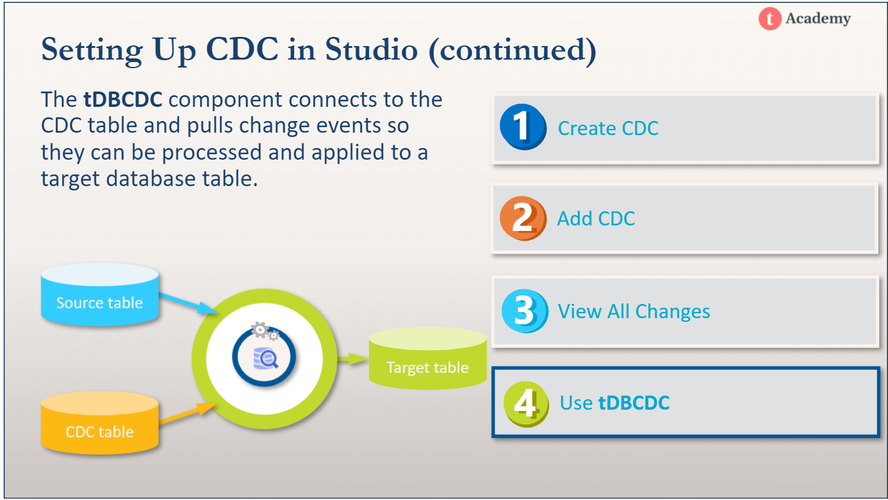

Subscriber tables

- A subscriber uses information captured in a CDC database to later update other databases.

Setting up a subscriber table

- Right-click CDC Foundation -> Create CDC -> Select the database that you want to monitor

The tsubscribers table

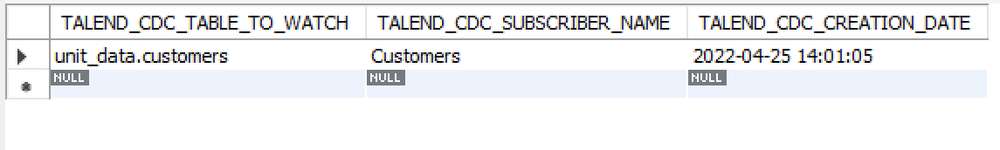

TABLE_TO_WATCH refers to the table being monitored.
SUBSCRIBER_NAME refers to the table that is doing the monitoring.
CREATION_DATE refers to the creation date of this record

CDC table

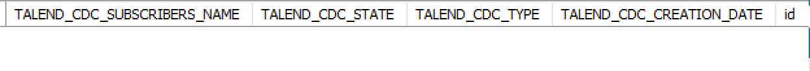

TALEND_CDC_SUBSCRIBERS_NAME: the name of the subscriber as listed in the tsubscribers table. In this exercise, Customers is the subscriber name and identifies the table being monitored.
TALEND_CDC_STATE: a flag indicating whether or not this change has been applied.
TALEND_CDC_TYPE: one of U, D, or I specifying the type of change (update, delete, or insert, respectively).
TALEND_CDC_CREATION_DATE: a time stamp specifying when the record changed.
id: the key value identifying the changed record. Notice that the name of this column is specific to the table being monitored. Remember that earlier, when retrieving the schema, you learned that the column id is the primary key for the customers table.

Creating a CDC table

1. Right-click the schema of the table that you want to monitor/create a CDC table for.
2. Select 'add CDC'
3. In the 'Subscriber name' textbox, input the name of your CDC table
4. Execute the query - this will do 2 things
   1. Creates a new table and a new view in the CDC database that records changes to the monitored table in your production database
   2. The subscriber table is populated with a record showing that this CDC table monitors the monitored table

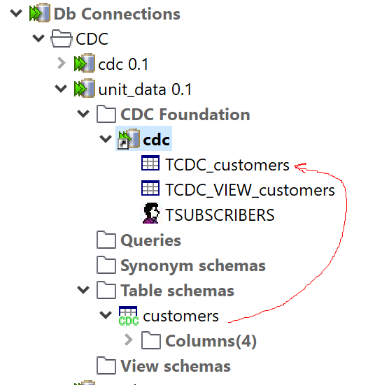

Supported databases and CDC modes

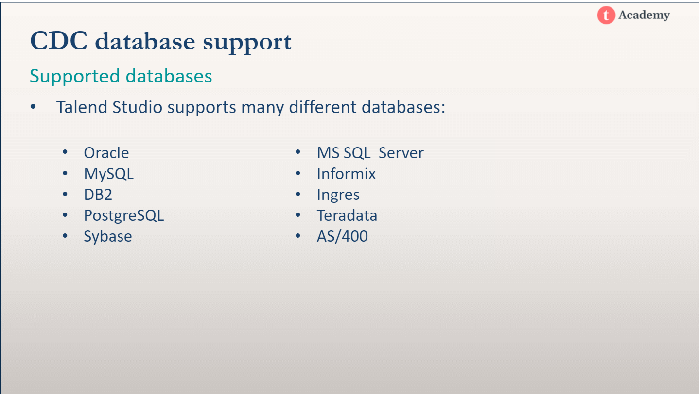
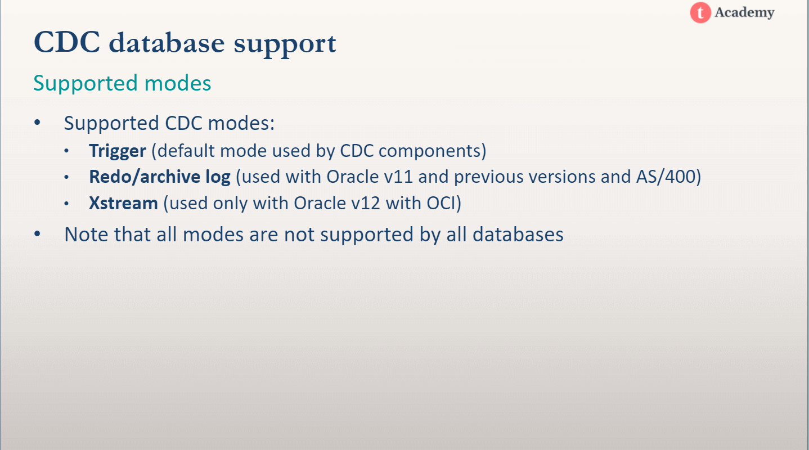

