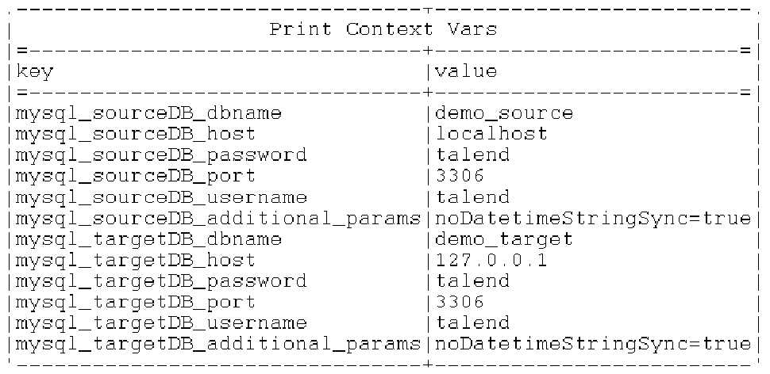

---
export_on_save:
  html: true
---
# [Context Management with AWS Secrets Manager](https://cdn5.dcbstatic.com/files/t/a/talendacademy_docebosaas_com/1651766400/sdRBIB-yDMJcefOGcFxpIw/item/f55b4d6f1d7a08cc0766d03bbb920a047091cc34.pdf)

Making use of existing context variables that hold the names of AWS secrets to retrieve the key, value pairs stored in each secret from AWS Secrets Manager and then to load them as context variables.

1. **tContextDump** 
    Load all context variables

    

2. **tFilterRow** 
    Filter context variables that end in "aws_secret"

    

3. **tJavaFlex** 
    Creates an AwsSecretsManagerUtil instance for making API requests to AWS Secrets Manager.
    Then for each input data row, we do the following:
      - Retrieve the secret from AWS Secrets Manager
      - Then we set the output row's value column to the returned JSON string after removing the curly braces ({})
      - We also create two more output columns: 
        - "secret_found", which will be a truth-value representating whether the retrieval was successful
        - "context_prefix" which is the part of the context variable name without the "aws_secret" suffix. (We will use this to create our db connection context variable names later on)
      - We also catch any exceptions should they occur
      
    

4. **tNormalize** 
    Splits JSON object into key, value pairs, creating a new row/record for each key, value pair

    

5. **tJavaRow**
    For each row in our "value" column:
    - We extract the key and value parts from the key, value string and create a table with key and value columns which are then loaded as context variables.

    - We split the key, value pairs (which look like this: ""key": "value"")
    - Then to create the context variable name, we prepend the "context_prefix" from earlier to the key, removing any "/".
    - And we also remove any "/" from the values.

    

6. **tContextLoad**
    Finally, we load the context variables extracted from our secrets in AWS Secret Manager for db connections to both our databases.